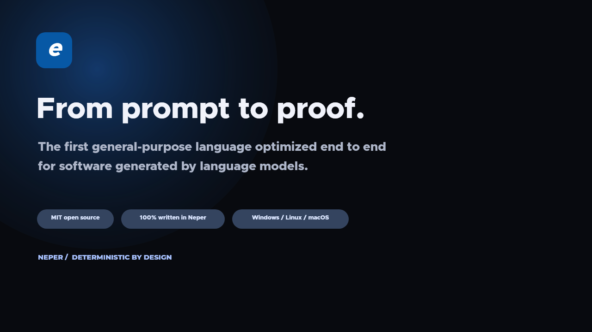

<p align="center">
  <a href="https://neper.dev"></a>
</p>

<p align="center">
  <b>The first general-purpose programming language optimized end to end for LLM-generated software.</b>
</p>

<p align="center">
  <a href="https://neper.dev">Website</a> ·
  <a href="https://neper.dev/#demo">Demo</a> ·
  <a href="https://discord.gg/AdRneEsbCu">Discord</a> ·
  <a href="docs/module-apis.md">Standard library</a> ·
  <a href="docs/decisions.md">Design decisions</a>
</p>

Build deterministic native software for Windows, Linux, macOS, CPU, and GPU. Neper is
MIT open source, designed for AI coding agents, and 100% self-hosted — from compiler and
linker to its ultra-rich standard library.

```neper
use e.io

fn main(args: []str) -> err {
    try io.print("Hello, Neper")
    ret ok
}
```

```text
$ neper run hello.e
(32 msec, 3648 bytes)
Hello, Neper
```

| **1M+ LOC** | **< 1 sec** | **CPU + GPU** | **0 VM** |
|:---:|:---:|:---:|:---:|
| per second, per core | whole-project rebuild target | one language, one module | tiny native executables |
| **MIT** | **100% Neper** | **3 OS** | **Self-verifying** |
| open source, fork anything | self-hosted compiler + toolchain | Windows · Linux · macOS | byte-identical compiler fixed point |

## From prompt to native binary

Watch one agent generate, check, repair, test, and compile a CPU/GPU program without
leaving the deterministic Neper toolchain.

<p align="center">
  <a href="https://neper.dev/#demo">
    
  </a>
  <br>
  <sub>▶ <a href="https://neper.dev/#demo">Watch the demo</a> · <a href="docs/gtm/neper-capabilities.mp4">download the MP4</a></sub>
</p>

## Everything between prompt and binary is optimized

Neper is not a familiar language with an AI tool bolted on. Its vocabulary, compiler
protocol, library, artifacts, and hardware model are designed as one system for
generated software.

- **Ultra fast — one million lines, under one second.** A direct emitter,
  declaration-level incremental work, and no LLVM make 1M+ lines/sec/core the baseline
  design target, not a stretch goal.
- **Ultra small — every bit counts.** Neper traces every reachable function, type, and
  constant, then strips everything else. No VM, garbage collector, or LLVM runtime. Ship
  the program, not the toolchain.
- **Ultra rich — a standard library built to finish products.** Algorithms, crypto,
  codecs, compression, data, networking, time, concurrency, UI, ML, and GPU compute,
  versioned and tested together.
- **Ultra precise — keywords optimized for model tokens.** A compact, frozen vocabulary
  gives every keyword one job. No aliases, overloads, contextual meanings, or macro
  dialects to make the model guess.

## Batteries included

One coherent library surface replaces dependency archaeology. Every module is fenced,
fixture-driven, and available to the compiler, the agent, and the reviewer under the
same version.

| **344** | **1,232** | **112** |
|:---:|:---:|:---:|
| [standard-library modules](docs/modules.json) | [standard-library algorithms](docs/algos.md) | [native UI controls](docs/ux/components) |

| Module | Covers |
|---|---|
| `e.algo` | sorting, search, graphs, geometry, hashing, random |
| `e.crypto` | hashes, signatures, encryption, key derivation, X.509 |
| `e.codec` | JSON, XML, CSV, images, archives, binary formats |
| `e.compress` | deflate, gzip, zstd, lz4, brotli, streaming codecs |
| `e.data` | collections, tables, schemas, query, validation |
| `e.net` | HTTP, TLS, DNS, WebSocket, QUIC, MQTT |
| `e.text` | Unicode, regex, search, diff, templates, locale |
| `e.time` | calendars, time zones, schedules, monotonic clocks |
| `e.task` | threads, synchronization, pools, resilience |
| `e.ui` | native windows, layout, controls, accessibility |
| `e.ml` | linear algebra, classifiers, clustering, neural nets |
| `e.gpu` | CPU, Vulkan, CUDA, tensors, images, presentation |

Every public signature is listed in [`docs/module-apis.md`](docs/module-apis.md).

<p align="center">
  
  <br>
  <sub><b>Neper Forge</b> — navigation, data, actions, status, progress, tables, and responsive surfaces as one native design system.</sub>
</p>

## One module, every processor

Write once. Step on CPU. Launch on GPU. A plain Neper function marked `@gpu` compiles
beside its host code. Run the same kernel on the CPU for exact debugging, then launch it
through Vulkan or CUDA without changing languages or build systems.

```neper
use e.gpu

@gpu(256)
fn saxpy(a: f32, x: []const f32, y: []f32) {
    let i = usize(gpu.gid.x)
    if i < x.len { y[i] = a*x[i] + y[i] }
}

fn run(q: *gpu.Queue, x: []const f32, y: []f32) -> err {
    let dx = try gpu.upload[f32](q, x)
    let dy = try gpu.upload[f32](q, y)
    try gpu.launch[saxpy](q, gpu.grid1(x.len), 2.0, dx, dy)
    try gpu.download(q, dy, y)
    ret ok
}
// q may target .Cpu, .Vulkan, or .Cuda
```

One type system and module · compile-time checked kernel arguments · explicit transfers
and synchronization · CPU backend for deterministic debugging.

## Optimized for every step an LLM takes

"LLM-friendly" is not syntax sugar. Neper reduces uncertainty and token cost across
generation, retrieval, editing, compilation, repair, testing, and final verification.

| | Contract |
|---|---|
| **Go** | Fast builds, but a runtime-centered contract: garbage collection, external language-server state, and separate build, test, and provenance surfaces leave agents coordinating several sources of truth. |
| **TypeScript** | Excellent tooling, but many delivery layers: a runtime, transpilation, package scripts, configuration, and a large dependency graph make native proof harder. |
| **Neper** | One deterministic contract from edit to artifact: compact explicit semantics, bounded compiler context, transactional edits, causal diagnostics, machine-applicable repairs, hermetic native builds, and content-addressed verification. |

**From prompt to proof.** Every source snapshot, semantic edit, dependency, unsafe
boundary, test, and native artifact is connected by verifiable hashes.

<details>
<summary><b>The 26 guarantees</b></summary>

| Guarantee | What it means | Why it matters |
|---|---|---|
| Verification receipts | One content-addressed receipt binds the requested behavior, source snapshot, toolchain, tests, environment, unsafe boundaries, and native artifact. | Trust becomes portable, inspectable evidence. |
| Self-verifying compiler | The compiler compiles itself again and reaches a byte-identical fixed point. | The toolchain proves its own consistency. |
| Deterministic artifacts | Offline builds, content identities, immutable snapshots, and authenticated caches. | Same inputs always produce comparable results. |
| Transactional edits | Rename and change plans verify snapshot hashes and unrelated-diff guards before anything is applied. | Stale or partial changes cannot silently land. |
| Semantic conflict detection | Parallel agent changes are merged against a shared snapshot, checked for textual and semantic conflicts, then reverified together. | Parallel agents cannot merge incompatible meanings. |
| Causal diagnostics | Stable codes, exact spans, expected and actual types, related causes, and bounded notes. | Models fix causes instead of chasing symptoms. |
| Machine-applicable repairs | Typed fixes include confidence, preconditions, and affected spans. | Repairs are checked actions, not guesses. |
| Bounded semantic context | The compiler returns the types, effects, ownership, callers, and dependencies needed for one edit. | Models get truth without repository overload. |
| Compiler-issued LLM cards | The grammar, APIs, diagnostics, and capability surface are emitted as compact model context. | Documentation cannot drift from the active compiler. |
| Complete unsafe inventory | One command enumerates every unsafe boundary with its source, reason, and provenance. | Every escape hatch stays visible and auditable. |
| Script-free packages | Packages are hash-verified and stored immutably; installation executes no package code. | Installing dependencies cannot execute hidden code. |
| Hermetic build identity | Every tool, dependency, platform fact, input, and environment condition enters the build identity. | Ambient machine state cannot hide inside results. |
| Explicit semantics | Casts, allocation, ownership, error flow, transfers, and unsafe boundaries are written where they happen. | Critical behavior never depends on invisible inference. |
| Lossless syntax model | Tokens retain exact spans and trivia; the tree preserves source identity. | Tools edit code without destroying human intent. |
| Stable JSON protocols | Tokens, syntax, symbols, references, tests, builds, and results use versioned records. | Agents consume facts without parsing prose. |
| Built-in verification | Tests, timeouts, structured events, reproducible manifests, and self-host fixed points. | Work stops only when evidence says done. |
| Declaration-level reuse | Incremental builds recheck only affected declarations and explain every decision. | Feedback stays fast as projects grow. |
| Generated-code source maps | Diagnostics in generated files route back to the source span to change. | Models repair the real editable source. |
| Single-purpose keywords | A short, closed vocabulary with no synonyms or contextual meanings. | Fewer meanings reduce generation errors. |
| No overloaded names | Calls, operators, protocols, and imports never depend on a hidden candidate set. | Resolution is always one way. |
| Search-stable declarations | Every top-level declaration begins at column zero with a keyword; a file path is its module name. | Relevant code is cheap to locate. |
| Canonical formatting | One formatter produces one layout. | Formatting noise disappears from every diff. |
| Direct native toolchain | Native executables through Neper's own linker — no LLVM, VM, GC, or hidden scheduler. | Programs ship without runtime baggage. |
| Optimization explanations | The toolchain explains why code was retained, eliminated, rebuilt, instantiated, or linked. | Performance decisions stay inspectable. |
| Honest flaky-test outcomes | Retries cannot turn nondeterminism into a pass; attempts and seeds stay visible. | Nondeterminism cannot masquerade as correctness. |
| Measured token economics | Language changes are evaluated against tokenizer cost and verified repair success. | Language evolution must justify model cost. |

</details>

## Shape of the language

| | |
|---|---|
| Memory | Stack and explicit arenas. No GC, no global allocator. |
| Errors | `(T, err)` multi-return with `try`. No exceptions. |
| Abstraction | Compile-time parameters in `[...]`, monomorphised. No macros. |
| Vectors | Builtin `Vec[T, N]` and explicit `simd` intrinsics. No auto-vectoriser. |
| CPU targets | x64, aarch64, x86-32, emitted directly. |
| GPU targets | SPIR-V (Vulkan), PTX (CUDA); `@gpu` kernels also run on the CPU. |
| Safety | Bounds, null and overflow checks in debug; a failed check prints `file:line:col`, the values, and a backtrace. |
| Testing | `@test` functions run one process each, reported as deterministic JSONL. |

Source files end in `.e`; compiled modules end in `.em`, one per target.

## Build from source

The compiler is written in Neper. A throwaway C99 bootstrap builds it the first time.

```bash
scripts/build-selfhost.sh
```

On Windows, run `scripts/build-selfhost.ps1`. Both print the path of the self-hosted
compiler. Readiness is tracked in [`docs/progress.html`](docs/progress.html).

---

<p align="center">
  <b>One language. Every machine. Built for models.</b><br>
  <sub>MIT open source · 100% Neper · Windows, Linux, macOS</sub>
</p>
