# Neper charts and diagrams

Neper builds renderer-neutral chart layouts from borrowed data and caller-owned output storage. The same marks feed its CPU scene/PNG and SVG adapters. This guide collects the produced charts, their preview notes, and the charting-engine design and catalogue. Readiness scores remain in [progress.html](progress.html).

## Rendered previews (228/228)

The total includes rendered PNG/SVG pairs and the [planned gallery targets](chart-preview-backlog.txt).

| Chart | PNG preview | Vector |
|---|---|---|
| Accessible Palette | 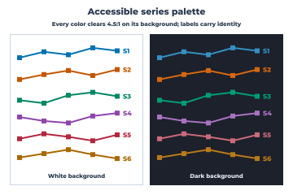 | [SVG](chart-previews/accessible_palette.svg) |
| Aggregate Decomposition Tree | 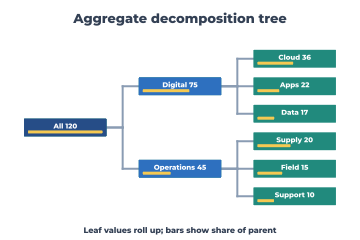 | [SVG](chart-previews/aggregate_decomposition_tree.svg) |
| Alluvial | 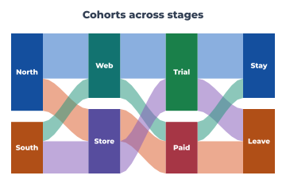 | [SVG](chart-previews/alluvial.svg) |
| Anom | 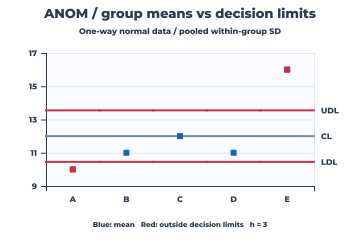 | [SVG](chart-previews/anom.svg) |
| Area | 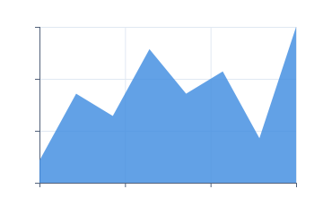 | [SVG](chart-previews/area.svg) |
| Association | 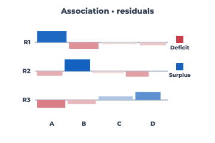 | [SVG](chart-previews/association.svg) |
| Attribute Agreement | 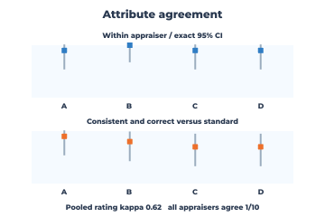 | [SVG](chart-previews/attribute_agreement.svg) |
| Band | 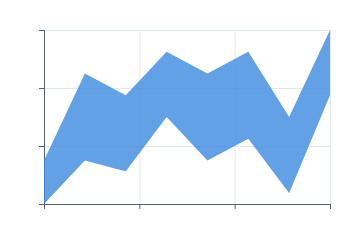 | [SVG](chart-previews/band.svg) |
| Bar | 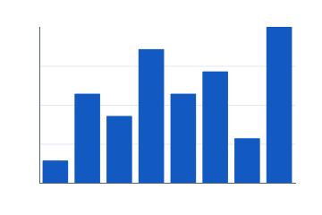 | [SVG](chart-previews/bar.svg) |
| Beeswarm | 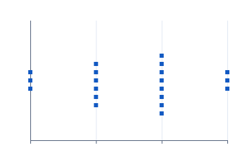 | [SVG](chart-previews/beeswarm.svg) |
| Bin2D | 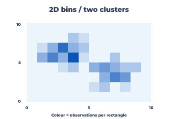 | [SVG](chart-previews/bin2d.svg) |
| Bland Altman | 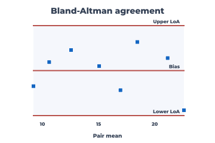 | [SVG](chart-previews/bland_altman.svg) |
| Bode | 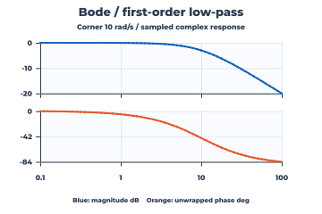 | [SVG](chart-previews/bode.svg) |
| Box | 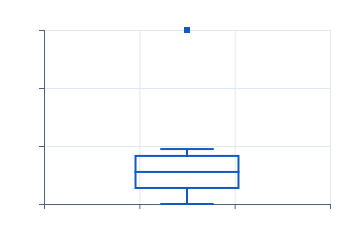 | [SVG](chart-previews/box.svg) |
| Boxen | 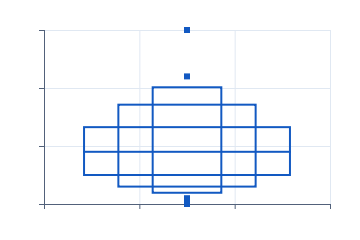 | [SVG](chart-previews/boxen.svg) |
| Branching Process Map | 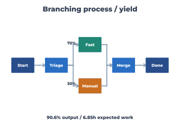 | [SVG](chart-previews/branching_process_map.svg) |
| Bubble | 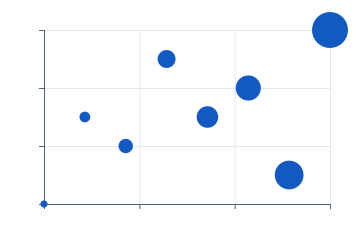 | [SVG](chart-previews/bubble.svg) |
| Bullet | 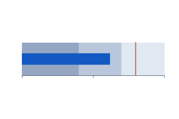 | [SVG](chart-previews/bullet.svg) |
| Burndown | 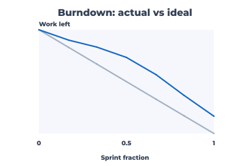 | [SVG](chart-previews/burndown.svg) |
| Burnup | 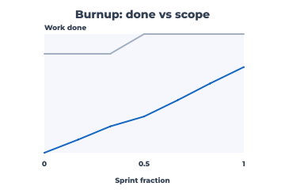 | [SVG](chart-previews/burnup.svg) |
| C Control | 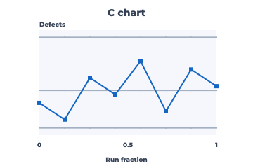 | [SVG](chart-previews/c_control.svg) |
| Calendar Heatmap | 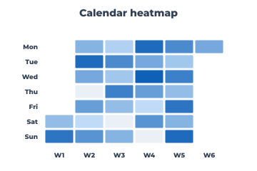 | [SVG](chart-previews/calendar_heatmap.svg) |
| Calibration | 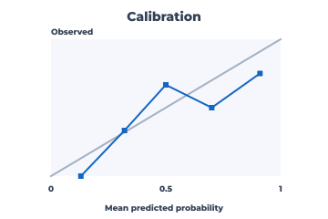 | [SVG](chart-previews/calibration.svg) |
| Candlestick | 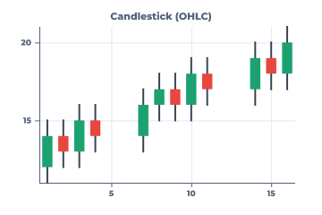 | [SVG](chart-previews/candlestick.svg) |
| Cap Table Waterfall | 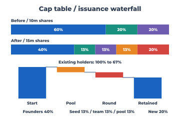 | [SVG](chart-previews/cap_table_waterfall.svg) |
| Capability Attribute | 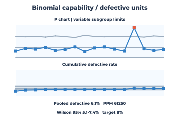 | [SVG](chart-previews/capability_attribute.svg) |
| Capability Batch | 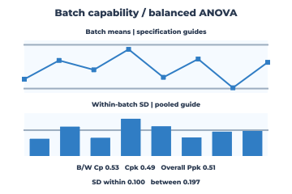 | [SVG](chart-previews/capability_batch.svg) |
| Capability Nonnormal | 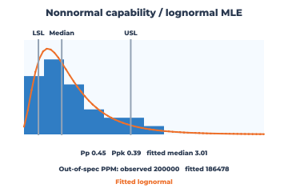 | [SVG](chart-previews/capability_nonnormal.svg) |
| Capability Normal | 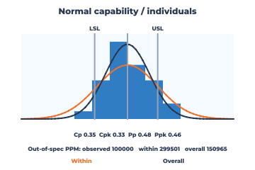 | [SVG](chart-previews/capability_normal.svg) |
| Capability Sixpack | 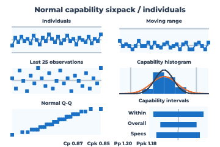 | [SVG](chart-previews/capability_sixpack.svg) |
| Category Facet | 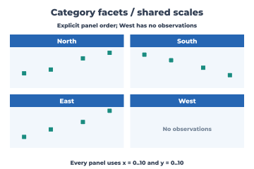 | [SVG](chart-previews/category_facet.svg) |
| Cause Effect Tree | 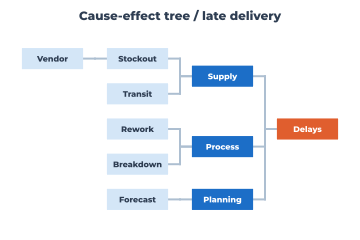 | [SVG](chart-previews/cause_effect_tree.svg) |
| Chord |  | [SVG](chart-previews/chord.svg) |
| Choropleth | 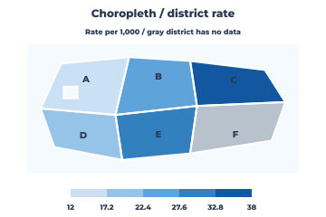 | [SVG](chart-previews/choropleth.svg) |
| Circle Pack | 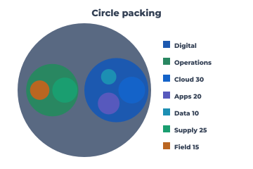 | [SVG](chart-previews/circle_pack.svg) |
| Clipped Annotation | 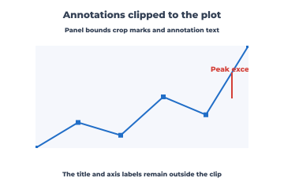 | [SVG](chart-previews/clipped_annotation.svg) |
| Cohort Retention | 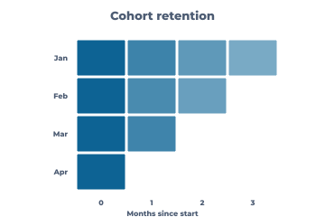 | [SVG](chart-previews/cohort_retention.svg) |
| Combo Bar Line | 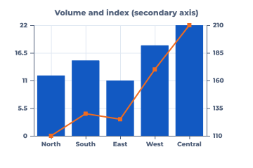 | [SVG](chart-previews/combo_bar_line.svg) |
| Confidence Band | 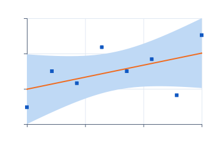 | [SVG](chart-previews/confidence_band.svg) |
| Confusion Matrix | 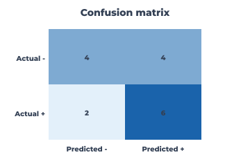 | [SVG](chart-previews/confusion_matrix.svg) |
| Connected Scatter | 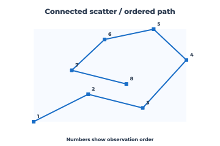 | [SVG](chart-previews/connected_scatter.svg) |
| Contour | 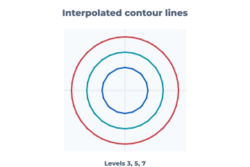 | [SVG](chart-previews/contour.svg) |
| Cooks Distance | 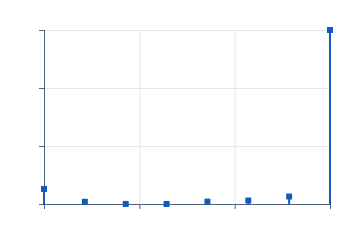 | [SVG](chart-previews/cooks_distance.svg) |
| Correlation | 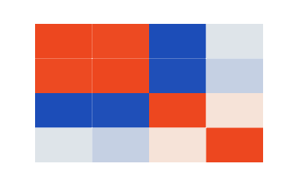 | [SVG](chart-previews/correlation.svg) |
| Correlogram | 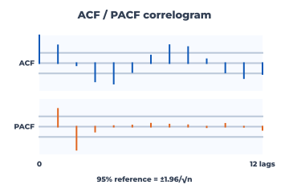 | [SVG](chart-previews/correlogram.svg) |
| Cross Tab Report | 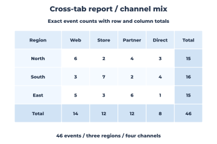 | [SVG](chart-previews/cross_tab_report.svg) |
| Cube Plot | 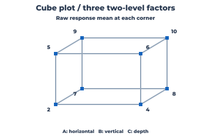 | [SVG](chart-previews/cube_plot.svg) |
| Cumulative Gain | 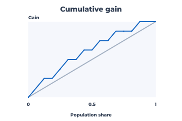 | [SVG](chart-previews/cumulative_gain.svg) |
| Cumulative Hazard | 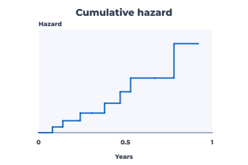 | [SVG](chart-previews/cumulative_hazard.svg) |
| Cumulative Lift | 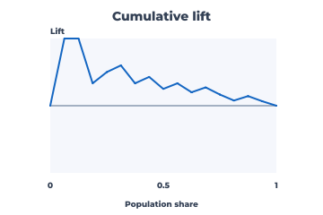 | [SVG](chart-previews/cumulative_lift.svg) |
| Cusum High | 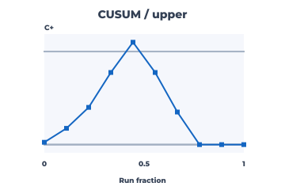 | [SVG](chart-previews/cusum_high.svg) |
| Cusum Low |  | [SVG](chart-previews/cusum_low.svg) |
| Data Ellipse |  | [SVG](chart-previews/data_ellipse.svg) |
| Date Axis Line |  | [SVG](chart-previews/date_axis_line.svg) |
| Decision Curve |  | [SVG](chart-previews/decision_curve.svg) |
| Decision Tree |  | [SVG](chart-previews/decision_tree.svg) |
| Decomposition |  | [SVG](chart-previews/decomposition.svg) |
| Density |  | [SVG](chart-previews/density.svg) |
| Density2D |  | [SVG](chart-previews/density2d.svg) |
| Density Surface3D |  | [SVG](chart-previews/density_surface3d.svg) |
| Dependency Graph |  | [SVG](chart-previews/dependency_graph.svg) |
| Discrete Axis Bar |  | [SVG](chart-previews/discrete_axis_bar.svg) |
| Donut |  | [SVG](chart-previews/donut.svg) |
| Dose Response |  | [SVG](chart-previews/dose_response.svg) |
| Dot Plot |  | [SVG](chart-previews/dot_plot.svg) |
| Drawdown |  | [SVG](chart-previews/drawdown.svg) |
| Dumbbell |  | [SVG](chart-previews/dumbbell.svg) |
| Earned Value |  | [SVG](chart-previews/earned_value.svg) |
| Ecdf |  | [SVG](chart-previews/ecdf.svg) |
| Entity Relationship |  | [SVG](chart-previews/entity_relationship.svg) |
| Errorbar |  | [SVG](chart-previews/errorbar.svg) |
| Euler2 |  | [SVG](chart-previews/euler2.svg) |
| Event Timeline |  | [SVG](chart-previews/event_timeline.svg) |
| Ewma Control |  | [SVG](chart-previews/ewma_control.svg) |
| Facet Heatmap |  | [SVG](chart-previews/facet_heatmap.svg) |
| Facet Scales |  | [SVG](chart-previews/facet_scales.svg) |
| Fan Forecast |  | [SVG](chart-previews/fan_forecast.svg) |
| Filled Contour |  | [SVG](chart-previews/filled_contour.svg) |
| Fishbone |  | [SVG](chart-previews/fishbone.svg) |
| Flowchart |  | [SVG](chart-previews/flowchart.svg) |
| Football Field |  | [SVG](chart-previews/football_field.svg) |
| Forest Plot |  | [SVG](chart-previews/forest_plot.svg) |
| Fourfold |  | [SVG](chart-previews/fourfold.svg) |
| Frequency Polygon |  | [SVG](chart-previews/frequency_polygon.svg) |
| Funnel |  | [SVG](chart-previews/funnel.svg) |
| Future State Vsm |  | [SVG](chart-previews/future_state_vsm.svg) |
| G Control |  | [SVG](chart-previews/g_control.svg) |
| Gage Bias Linearity |  | [SVG](chart-previews/gage_bias_linearity.svg) |
| Gage Rr |  | [SVG](chart-previews/gage_rr.svg) |
| Gage Run |  | [SVG](chart-previews/gage_run.svg) |
| Gantt |  | [SVG](chart-previews/gantt.svg) |
| Gauge |  | [SVG](chart-previews/gauge.svg) |
| Generalized Variance |  | [SVG](chart-previews/generalized_variance.svg) |
| Grouped Bar |  | [SVG](chart-previews/grouped_bar.svg) |
| Half Violin |  | [SVG](chart-previews/half_violin.svg) |
| Hazard Rate |  | [SVG](chart-previews/hazard_rate.svg) |
| Heatmap |  | [SVG](chart-previews/heatmap.svg) |
| Hexbin |  | [SVG](chart-previews/hexbin.svg) |
| Histogram |  | [SVG](chart-previews/histogram.svg) |
| Histogram3D |  | [SVG](chart-previews/histogram3d.svg) |
| Horizon |  | [SVG](chart-previews/horizon.svg) |
| Hotelling T2 |  | [SVG](chart-previews/hotelling_t2.svg) |
| Icicle |  | [SVG](chart-previews/icicle.svg) |
| In Cell Data Bars |  | [SVG](chart-previews/in_cell_data_bars.svg) |
| Individuals Control |  | [SVG](chart-previews/individuals_control.svg) |
| Influence Plot |  | [SVG](chart-previews/influence_plot.svg) |
| Interaction Plot |  | [SVG](chart-previews/interaction_plot.svg) |
| Interactive Selection |  | [SVG](chart-previews/interactive_selection.svg) |
| Kanban |  | [SVG](chart-previews/kanban.svg) |
| Kaplan Meier |  | [SVG](chart-previews/kaplan_meier.svg) |
| Kpi Target |  | [SVG](chart-previews/kpi_target.svg) |
| Labeled Line |  | [SVG](chart-previews/labeled_line.svg) |
| Labeled Log Scatter |  | [SVG](chart-previews/labeled_log_scatter.svg) |
| Labeled Symlog Line |  | [SVG](chart-previews/labeled_symlog_line.svg) |
| Laney P |  | [SVG](chart-previews/laney_p.svg) |
| Laney U |  | [SVG](chart-previews/laney_u.svg) |
| Legend Collision |  | [SVG](chart-previews/legend_collision.svg) |
| Leverage Residual |  | [SVG](chart-previews/leverage_residual.svg) |
| Line |  | [SVG](chart-previews/line.svg) |
| Log Scatter |  | [SVG](chart-previews/log_scatter.svg) |
| Lollipop |  | [SVG](chart-previews/lollipop.svg) |
| Main Effects |  | [SVG](chart-previews/main_effects.svg) |
| Marginal Histogram |  | [SVG](chart-previews/marginal_histogram.svg) |
| Matrix Report |  | [SVG](chart-previews/matrix_report.svg) |
| Mekko |  | [SVG](chart-previews/mekko.svg) |
| Mewma |  | [SVG](chart-previews/mewma.svg) |
| Milestone Roadmap |  | [SVG](chart-previews/milestone_roadmap.svg) |
| Missing Data Scatter |  | [SVG](chart-previews/missing_data_scatter.svg) |
| Monte Carlo Cdf |  | [SVG](chart-previews/monte_carlo_cdf.svg) |
| Monte Carlo Histogram |  | [SVG](chart-previews/monte_carlo_histogram.svg) |
| Mosaic |  | [SVG](chart-previews/mosaic.svg) |
| Moving Range Control |  | [SVG](chart-previews/moving_range_control.svg) |
| Multi Vari |  | [SVG](chart-previews/multi_vari.svg) |
| Np Control |  | [SVG](chart-previews/np_control.svg) |
| Nyquist |  | [SVG](chart-previews/nyquist.svg) |
| Oc Curve |  | [SVG](chart-previews/oc_curve.svg) |
| Ohlc |  | [SVG](chart-previews/ohlc.svg) |
| Org Chart |  | [SVG](chart-previews/org_chart.svg) |
| P Control |  | [SVG](chart-previews/p_control.svg) |
| Parallel Coordinates |  | [SVG](chart-previews/parallel_coordinates.svg) |
| Pareto |  | [SVG](chart-previews/pareto.svg) |
| Partial Auc |  | [SVG](chart-previews/partial_auc.svg) |
| Pert-Cpm-Network |  | [SVG](chart-previews/pert-cpm-network.svg) |
| Phase Control |  | [SVG](chart-previews/phase_control.svg) |
| Phase Space |  | [SVG](chart-previews/phase_space.svg) |
| Phased C Control |  | [SVG](chart-previews/phased_c_control.svg) |
| Phased Laney P |  | [SVG](chart-previews/phased_laney_p.svg) |
| Phased Laney U |  | [SVG](chart-previews/phased_laney_u.svg) |
| Phased Np Control |  | [SVG](chart-previews/phased_np_control.svg) |
| Phased P Control |  | [SVG](chart-previews/phased_p_control.svg) |
| Phased Range |  | [SVG](chart-previews/phased_range.svg) |
| Phased S |  | [SVG](chart-previews/phased_s.svg) |
| Phased U Control |  | [SVG](chart-previews/phased_u_control.svg) |
| Phased Xbar R |  | [SVG](chart-previews/phased_xbar_r.svg) |
| Phased Xbar S |  | [SVG](chart-previews/phased_xbar_s.svg) |
| Pie |  | [SVG](chart-previews/pie.svg) |
| Plot Grid |  | [SVG](chart-previews/plot_grid.svg) |
| Point Line |  | [SVG](chart-previews/point_line.svg) |
| Population Pyramid |  | [SVG](chart-previews/population_pyramid.svg) |
| Pp Normal |  | [SVG](chart-previews/pp_normal.svg) |
| Precision Recall |  | [SVG](chart-previews/precision_recall.svg) |
| Prediction Band |  | [SVG](chart-previews/prediction_band.svg) |
| Price Volume |  | [SVG](chart-previews/price_volume.svg) |
| Probability Plot |  | [SVG](chart-previews/probability_plot.svg) |
| Proportional Symbol Map |  | [SVG](chart-previews/proportional_symbol_map.svg) |
| Qq |  | [SVG](chart-previews/qq.svg) |
| Quiver |  | [SVG](chart-previews/quiver.svg) |
| Radar |  | [SVG](chart-previews/radar.svg) |
| Raincloud |  | [SVG](chart-previews/raincloud.svg) |
| Range Control |  | [SVG](chart-previews/range_control.svg) |
| Range Interval |  | [SVG](chart-previews/range_interval.svg) |
| Recurrence |  | [SVG](chart-previews/recurrence.svg) |
| Regression Fit |  | [SVG](chart-previews/regression_fit.svg) |
| Residual Fitted |  | [SVG](chart-previews/residual_fitted.svg) |
| Resource Histogram |  | [SVG](chart-previews/resource_histogram.svg) |
| Returns Volatility |  | [SVG](chart-previews/returns_volatility.svg) |
| Ribbon Rank |  | [SVG](chart-previews/ribbon_rank.svg) |
| Ridgeline |  | [SVG](chart-previews/ridgeline.svg) |
| Risk Matrix |  | [SVG](chart-previews/risk_matrix.svg) |
| Roc |  | [SVG](chart-previews/roc.svg) |
| Rose |  | [SVG](chart-previews/rose.svg) |
| Rug |  | [SVG](chart-previews/rug.svg) |
| Run Rules Control |  | [SVG](chart-previews/run_rules_control.svg) |
| S Control |  | [SVG](chart-previews/s_control.svg) |
| Sankey |  | [SVG](chart-previews/sankey.svg) |
| Scatter |  | [SVG](chart-previews/scatter.svg) |
| Scatter3D |  | [SVG](chart-previews/scatter3d.svg) |
| Scatterplot Matrix |  | [SVG](chart-previews/scatterplot_matrix.svg) |
| Seasonal Subseries |  | [SVG](chart-previews/seasonal_subseries.svg) |
| Sequence Diagram |  | [SVG](chart-previews/sequence_diagram.svg) |
| Shared Guide Facets |  | [SVG](chart-previews/shared_guide_facets.svg) |
| Sipoc |  | [SVG](chart-previews/sipoc.svg) |
| Slopegraph |  | [SVG](chart-previews/slopegraph.svg) |
| Sparkline |  | [SVG](chart-previews/sparkline.svg) |
| Spectrogram |  | [SVG](chart-previews/spectrogram.svg) |
| Spine Plot |  | [SVG](chart-previews/spine_plot.svg) |
| Stacked 100 |  | [SVG](chart-previews/stacked_100.svg) |
| Stacked Bar |  | [SVG](chart-previews/stacked_bar.svg) |
| State Machine |  | [SVG](chart-previews/state_machine.svg) |
| State Timeline |  | [SVG](chart-previews/state_timeline.svg) |
| Status History |  | [SVG](chart-previews/status_history.svg) |
| Stem And Leaf |  | [SVG](chart-previews/stem_and_leaf.svg) |
| Step |  | [SVG](chart-previews/step.svg) |
| Streamgraph |  | [SVG](chart-previews/streamgraph.svg) |
| Streamlines |  | [SVG](chart-previews/streamlines.svg) |
| Strip |  | [SVG](chart-previews/strip.svg) |
| Sunburst |  | [SVG](chart-previews/sunburst.svg) |
| Swimlane |  | [SVG](chart-previews/swimlane.svg) |
| Symlog Line |  | [SVG](chart-previews/symlog_line.svg) |
| T Control |  | [SVG](chart-previews/t_control.svg) |
| Ternary |  | [SVG](chart-previews/ternary.svg) |
| Tornado |  | [SVG](chart-previews/tornado.svg) |
| Treemap |  | [SVG](chart-previews/treemap.svg) |
| U Control |  | [SVG](chart-previews/u_control.svg) |
| Value-Stream-Map |  | [SVG](chart-previews/value-stream-map.svg) |
| Variogram |  | [SVG](chart-previews/variogram.svg) |
| Venn3 |  | [SVG](chart-previews/venn3.svg) |
| Violin |  | [SVG](chart-previews/violin.svg) |
| Waffle |  | [SVG](chart-previews/waffle.svg) |
| Waterfall |  | [SVG](chart-previews/waterfall.svg) |
| Waterfall Spectrum |  | [SVG](chart-previews/waterfall_spectrum.svg) |
| Weibull Probability |  | [SVG](chart-previews/weibull_probability.svg) |
| Wireframe3D |  | [SVG](chart-previews/wireframe3d.svg) |
| Word Cloud |  | [SVG](chart-previews/word_cloud.svg) |
| Xbar Control |  | [SVG](chart-previews/xbar_control.svg) |
| Xbar S Control |  | [SVG](chart-previews/xbar_s_control.svg) |
| Yield Curve |  | [SVG](chart-previews/yield_curve.svg) |
| Youden Index |  | [SVG](chart-previews/youden_index.svg) |

## Charting-engine delivery evidence

Foundation in `lib/e/gfx/chart.e` covers borrowed numeric columns and caller-owned scatter/line/bar/step marks, area polygons, lollipop stems and center/lower/upper error bars, plus histogram bins, sorted ECDF, R7 box plots, Gaussian density, normal Q-Q and mirrored-KDE violin. Confidence bands close ordered lower/upper columns into a caller-owned polygon; horizontal dumbbells emit paired endpoints and their connecting segments. `gfx_chart_intervals` checks geometry, scene/SVG commands, containment, ordering and capacity refusals on Windows and Linux. Cartesian `Spec` supports independent linear, log10, symmetric-log and reverse x/y scales; `ticks` emits caller-owned values/positions and `e.gfx.chart.scene` draws grid, axis and tick strokes. `nice_ticks` selects 1/2/5 linear steps and 1/2/5 log-decade candidates, with symmetric-log retaining equal transformed-space positions; `format_ticks` writes shortest-round-trip f32 labels into caller-owned storage and refuses an empty buffer without trapping. `gfx_chart_nice_ticks` checks linear/log/symmetric-log/reverse breaks, labels and refusal paths on Windows and Linux. `guide_labels` positions tick strings in caller-owned metadata, while scene text reuses `e.text.layout` and a registered TrueType font and SVG streams escaped `<text>`; `gfx_chart_labels` checks alignment, title escaping and refusals on Windows and Linux. Row-major heatmaps, Pearson correlation matrices and equal-panel facet geometry emit caller-owned cells/rectangles. `layout_with_limits` borrows optional x/y domains for shared or free facet scales, rejecting limits that exclude the data or baseline; `gfx_chart_facet` covers the geometry and refusal paths. `e.gfx.chart.svg` streams solid-colour marks, matrix tiles and guides with escaped accessible metadata and colours matching current CPU scene channel packing. `gfx_chart`, `gfx_chart_qq`, `gfx_chart_matrix`, `gfx_chart_cartesian`, `gfx_chart_scale`, `gfx_chart_facet`, `gfx_chart_intervals`, `gfx_chart_labels`, `gfx_chart_nice_ticks` and `gfx_chart_svg` check geometry, statistics, scales, scene/SVG commands and refusal paths; `examples/chart_gallery.e` rendered one hundred and seventeen inspected PNG previews and one hundred and seventeen XML-parsed SVG companions in `docs/chart-previews/`, including labeled linear, log and symmetric-log examples. Detailed registry and staged plan: `docs/charting-engine-plan.md`. Category-major `grouped_bars` and `stacked_bars` reuse per-series Bar layouts for grouped, signed-stacked and 100%-stacked rectangles; `gfx_chart_composition` checks geometry, scene/SVG commands and refusal paths on Windows and Linux. `category_ticks` supplies ordinal centers for the existing label pass and `legend_items` pairs caller-owned swatch geometry with borrowed series names; `gfx_chart_composition` checks placement, escaping, scene/SVG output and refusals on both hosts. The three bar previews now show category text and two-series legends in PNG and SVG. `frequency_polygon` reuses histogram bin counts and links their centers to a zero baseline; `rug` emits independent short x-axis strokes, retaining tied observations. `gfx_chart_distribution` checks geometry, reuse, adapters and refusals on Windows and Linux; the gallery adds two PNG/SVG pairs. `PointLine` composes scatter points and connected segments under one domain; `strip` maps numeric observations to deterministic vertical jitter, preserving ties without collision avoidance. `gfx_chart_distribution` checks their geometry, capacity refusals and scene/SVG output on Windows and Linux, and the gallery adds two more PNG/SVG pairs. `beeswarm` keeps numeric x positions and packs overlapping square marks into free vertical lanes, returning `TooLarge` if the panel is too short; its candidate scan is cubic in the worst case. `dot_plot` reuses histogram bin counts and stacks one dot per observation, also refusing vertical overflow. Both reuse the scatter scene/SVG branches, and `gfx_chart_distribution` checks geometry, capacity and adapters on Windows and Linux. The gallery adds two more PNG/SVG pairs. `e.gfx.scene.damage_of` now avoids shifting pixels beneath unchanged prefix/suffix paint; the two-frame `gfx_chart_distribution` regression fails without the guard and passes on Windows and Linux, and the gallery re-renders without stray guide ticks. `waterfall` derives floating signed steps, a closing total and level connectors from an opening amount plus changes, reusing bar and segment scene/SVG paths; `gfx_chart_composition` checks geometry, refusal paths and both adapters on Windows and Linux, and the gallery adds the thirty-fourth PNG/SVG pair. `e.gfx.chart.scene.rasterize` now returns caller-owned straight-RGBA output, releases compiled scenes on errors and composes with `e.fmt.png.encode` after arena-backed writer creation; `gfx_chart_png` checks a transparent PNG round trip on Windows and Linux, and the gallery uses this export path for all seventy-three PNGs. `bullet` composes descending qualitative-range bars, a slim actual bar and a target rule from existing Bar/Rug layers; `gfx_chart_composition` checks geometry, capacity, refusal paths and scene/SVG output on Windows and Linux, and the gallery adds the thirty-fifth PNG/SVG pair. `pareto` stably orders nonnegative category counts into frequency Bar and cumulative-fraction PointLine layers with independent y domains; `gfx_chart_composition` checks geometry, refusals and scene/SVG adapters on Windows and Linux, and the gallery adds the thirty-sixth PNG/SVG pair with labeled count and percentage axes. `pie` emits caller-owned Area polygons for nonnegative category weights, with a zero inner-radius ratio for pie and a positive ratio for donut; `gfx_chart_polar` checks geometry, invalid input, storage refusal and scene/SVG adapters on Windows and Linux. The gallery adds the thirty-seventh and thirty-eighth PNG/SVG pairs with category legends. `waffle` divides a caller-sized grid into cumulative-rounded category cells as Bar layers; `funnel` turns nonincreasing stage counts into centered trapezoid Area layers. `gfx_chart_funnel_grid` checks geometry, invalid input, caller capacity and scene/SVG adapters on Windows and Linux. The gallery adds the thirty-ninth and fortieth PNG/SVG pairs with category legends. `bubble` reuses scatter x/y scales and maps a nonnegative size column to circle area, with caller-owned circle bounds; scene cubic paths and SVG circle marks share the layout. `gfx_chart_bubble` checks area ratios, log mapping, zero-size marks, invalid inputs, caller capacity and both adapters on Windows and Linux. The gallery adds the forty-first PNG/SVG pair. A quantitative size legend and overlap policy remain. `regression_line` uses the existing streaming OLS accumulator to return a fitted Line and a domain shared with scatter; `covariance_ellipse` returns a caller-resolution data-ellipse Line at a caller-selected Mahalanobis radius, refusing singular covariance. `gfx_chart_overlays` checks exact linear references, constant-y fits, rotated and singular covariance, storage refusals and scene/SVG adapters on Windows and Linux. The gallery adds the forty-second and forty-third PNG/SVG pairs. `regression_interval` computes pointwise OLS mean-confidence and new-observation prediction ribbons from residual variance and leverage, with a caller-supplied two-sided Student-t critical value; it returns aligned Band and Line layers on a domain that also contains the observations. `gfx_chart_overlays` checks numerical references, singular/short samples, critical/storage refusals and scene/SVG adapters on Windows and Linux. The gallery adds the forty-fourth and forty-fifth PNG/SVG pairs. Simultaneous bands, automatic quantiles and nonlinear smoothers remain planned. `combo_bar_line` reuses Bar and PointLine layout at shared category centers with independent baseline-inclusive left and line right domains; `gfx_chart_composition` checks signed values, axis alignment, invalid/capacity paths and scene/SVG adapters on Windows and Linux. The gallery adds the forty-sixth PNG/SVG pair with numeric secondary-axis guides. Irregular x, more than two axes and aligned axis tables remain planned. `ridgeline` evaluates Gaussian KDE for each concatenated group on a common grid, scales heights by the global peak and emits overlapping caller-owned Area layers. `gfx_chart_ridgeline` checks numeric values, malformed groups, invalid overlap/bandwidth and storage refusals plus scene/SVG output on Windows and Linux. The gallery adds the forty-seventh PNG/SVG pair with readable x ticks and group labels. Weighted density and transformed x axes remain planned. `candlestick` and `ohlc` map strictly increasing numeric x plus validated open/high/low/close columns into caller-owned Rug and Bar layers, preserving irregular gaps and doji marks. `gfx_chart_finance` checks numeric references, malformed prices/x, capacity and scene/SVG adapters on Windows and Linux; the gallery adds the forty-eighth and forty-ninth PNG/SVG pairs. Date formatting, corporate-action adjustment and volume companions remain planned. `treemap` lays out a parent-before-child hierarchy with proportional leaf Bar rectangles and caller-owned group bounds. `gfx_chart_treemap` checks area, invalid hierarchy/weights/capacity and scene/SVG output on Windows and Linux; the gallery adds the fiftieth labeled PNG/SVG pair. Squarified packing and interactive drilldown remain planned. `sunburst` shares tree validation and subtree totals, maps ordered siblings to angular sectors and depth rings, and emits caller-owned Area polygons. `gfx_chart_sunburst` checks numeric spans, zero leaves, invalid data/storage and scene/SVG output on Windows and Linux; the gallery adds the fifty-first PNG/SVG pair. Curved labels and adaptive tessellation remain planned. `icicle` shares validated hierarchy totals, maps subtree shares into horizontal depth bands, extends shallow leaves to the bottom, and reuses Bar scene/SVG adapters. `gfx_chart_icicle` checks proportions, depth, zero leaves, invalid data/storage and both adapters on Windows and Linux; the gallery adds the fifty-second PNG/SVG pair. `circle_pack` reuses hierarchy totals to place ordered, non-overlapping sibling circles with areas proportional to subtree totals, using caller-owned bounds and Bubble scene/SVG adapters. `gfx_chart_circle_pack` checks area ratios, nested containment, separation, zero nodes, invalid data/storage and both adapters on Windows and Linux; the gallery adds the fifty-third PNG/SVG pair. Ring placement is not density-optimal. `population_pyramid` maps two aligned nonnegative age columns to opposing horizontal Bar layers with a shared maximum, central label gutter and row gaps. `gfx_chart_population_pyramid` checks reference geometry, invalid counts/gaps/storage and scene/SVG adapters on Windows and Linux; the gallery adds the fifty-fourth PNG/SVG pair. `sankey` lays out ordered forward weighted links as caller-owned smoothstep Area ribbons and Bar nodes on a shared flow scale across columns. `gfx_chart_sankey` checks two- and three-column geometry, zero links, invalid data/storage and scene/SVG adapters on Windows and Linux; the gallery adds the fifty-fifth PNG/SVG pair. Automatic crossing reduction remains planned. `alluvial` reuses Sankey ribbons for adjacent-stage links and checks conservation at every interior stratum. `gfx_chart_alluvial` checks four-stage geometry, skipped links, imbalance, capacity and scene/SVG adapters on Windows and Linux; the gallery adds the fifty-sixth PNG/SVG pair with stable caller-supplied cohort colours. Automatic crossing reduction and inferred cohort identity remain planned. `streamgraph` centers nonnegative sample-major series around a silhouette baseline at one shared vertical scale and returns caller-owned Area polygons. `gfx_chart_streamgraph` checks numeric geometry, malformed data, capacity and scene/SVG adapters on Windows and Linux; the gallery adds the fifty-seventh PNG/SVG pair. Wiggle offsets and automatic layer ordering remain planned. `chord` maps a directed square matrix to outer group arcs and caller-owned Area ribbons, preserving asymmetric pair weights and self loops. `gfx_chart_chord` checks numeric geometry, self links, zero pairs, malformed matrices, capacity and scene/SVG adapters on Windows and Linux; the gallery adds the fifty-eighth PNG/SVG pair. Adaptive curve tessellation, direction arrows and highlighting remain planned. `mekko` gives each category a width proportional to its total and each series cell a height proportional to its within-category share, so cell area encodes its fraction of the grand total. `gfx_chart_mekko` checks numeric proportions, empty/invalid tables, zero-width categories, capacity and scene/SVG adapters on Windows and Linux; the gallery adds the fifty-ninth PNG/SVG pair. `euler2` solves exact two-circle intersection area from two set totals and their overlap; `venn3` supplies seven membership anchors for a nominal, non-area-proportional three-set layout. `gfx_chart_venn_euler` checks geometric references, membership, invalid inputs, capacity and scene/SVG adapters on Windows and Linux; the gallery adds the sixtieth and sixty-first PNG/SVG pairs. Arbitrary three-set region-area fitting remains planned. `ribbon_rank` maps sample-major values into equal-height ordinal Area bands over ordered x positions, with larger values ranked first and stable input-order ties. `gfx_chart_ribbon_rank` checks reference ranks, ties, malformed inputs, capacity and scene/SVG adapters on Windows and Linux; the gallery adds the sixty-second PNG/SVG pair. Missing categories and curved crossover interpolation remain planned. `gauge` returns background and measured semicircular Area rings plus a target Rug rule at a validated positive maximum; `target_status` returns signed delta and attainment for either target direction. `gfx_chart_gauge` checks geometry, zero/full values, malformed inputs, capacity, status rules and scene/SVG adapters on Windows and Linux. A KPI card composes existing bullet layers with this status; the gallery adds the sixty-third and sixty-fourth PNG/SVG pairs. Dynamic labels, threshold bands and widget binding remain planned. `word_cloud` maps pre-tokenized unique weighted words to legible sizes, honors exact-match exclusions and packs measured text boxes by deterministic spiral placement with collision and bounds checks. `gfx_chart_word_cloud` verifies weight order, exclusions, refusals and scene/SVG text on Windows and Linux; the gallery adds the sixty-fifth PNG/SVG pair. Tokenization, case normalization, font embedding and scalable packing remain planned. `state_timeline` maps ordered f64 half-open intervals into row-aligned Bar layers, coalesces exact abutting equal states and leaves gaps blank. `gfx_chart_state_timeline` checks large timestamps, ordering, overlap, gaps, invalid state/domain, capacity and scene/SVG adapters on Windows and Linux; the gallery adds the sixty-sixth and sixty-seventh PNG/SVG pairs for operational state timelines and status histories. Date/time formatting, timezone semantics and event annotations remain planned. `sparkline` maps dense evenly spaced samples through existing Line layers for guide-free in-cell rows. `calendar_heatmap` maps sorted day offsets to sparse week/weekday Heatmap cells with caller gaps; missing days remain blank. `gfx_chart_calendar_sparkline` checks geometry, invalid input, short storage and scene/SVG adapters on Windows and Linux; the gallery adds the sixty-eighth and sixty-ninth PNG/SVG pairs. Calendar/date labels, locale policy, missing sparkline samples and shared in-cell scales remain planned. `event_timeline` maps sorted f64 timestamps to lane-centered Lollipop points and stems, and `in_cell_bars` maps nonnegative values against a common maximum within caller-owned cells; zero values leave the track blank. `gfx_chart_events_cellbars` checks large timestamps, geometry, ordering, invalid values and storage plus scene/SVG adapters on Windows and Linux; the gallery adds the seventieth and seventy-first PNG/SVG pairs. Event label collision, nullable report data and per-row normalization remain planned. `forest_plot` maps validated effect intervals and center estimates on linear/log/symlog scales with a separate reference rule. `e.algo.stat.agreement_limits` computes paired-difference bias and sample-SD limits at a caller-selected multiplier; `bland_altman` maps means, differences and three guides to existing Scatter/Rug layers. `gfx_chart_agreement_forest` checks numeric references, refusals and scene/SVG adapters on Windows and Linux; the gallery adds the seventy-second and seventy-third PNG/SVG pairs. Forest weighting/pooled estimates, limits confidence intervals and proportional-bias analysis remain planned. `e.algo.stat.binary_curve` groups tied scores into one threshold; `roc_auc` and `average_precision` yield checked reference values, while `e.gfx.chart.binary_metric_curve` reuses Line geometry for ROC, precision–recall, cumulative gain and lift. `gfx_chart_binary_curves` checks ties, class/storage refusals and scene/SVG output on Windows and Linux; four new PNG/SVG gallery pairs bring the total to seventy-seven. `binary_calibration` validates unit probabilities and aggregates caller-owned equal-width bins, while `binary_confusion` counts thresholded outcomes. Existing PointLine and Heatmap marks render calibration and a 2x2 confusion matrix; `gfx_chart_diagnostic_tables` checks reference values, refusals and scene/SVG output on Windows and Linux. Two more PNG/SVG pairs bring the total to seventy-nine. `roc_partial_auc` integrates to an explicit false-positive cutoff, `youden_index` selects the highest-score point maximizing sensitivity minus false-positive rate, and `decision_curve` computes model/treat-all net benefit over probability thresholds. `roc_partial_region` reuses Area geometry; Line and Rug mark the decision curves and Youden point. `gfx_chart_binary_curves` checks reference values, invalid/capacity paths and scene/SVG adapters on Windows and Linux; three more PNG/SVG pairs bring the total to eighty-two. `e.algo.stat.regression_diagnostics` computes fitted values, raw and internally standardized residuals, leverage and Cook's distance from one OLS fit, rejecting singular/exact fits and short storage. Existing Scatter and Lollipop layouts render residual/fitted, leverage/residual and Cook-by-observation previews. `gfx_chart_regression_diagnostics` checks numeric references, refusals and scene/SVG output on Windows and Linux; three more PNG/SVG pairs bring the total to eighty-five. `e.algo.stat.survival_curve` groups sorted follow-up times with tied events preceding censoring, emitting Kaplan–Meier survival, Nelson–Aalen cumulative hazard and at-risk/event/censor counts. Existing Step and Scatter marks render survival, hazard and censor markers. `gfx_chart_survival` checks reference fractions, tied and all-censored cases, invalid/storage refusals and scene/SVG output on Windows and Linux; two more PNG/SVG pairs bring the total to eighty-seven. Greenwood intervals, log-rank comparisons and competing risks remain planned. `e.algo.stat.imr_limits` computes consecutive moving ranges and three-sigma Individuals/MR limits; `xbar_r_limits` computes subgroup means, ranges and A2/D3/D4 limits for sizes 2–10. Existing PointLine and Rug marks draw the four control charts and their upper/center/lower rules. `gfx_chart_control` checks NIST numeric references, refusals and scene/SVG output on Windows and Linux; four more PNG/SVG pairs bring the total to ninety-one. `e.algo.stat.attribute_control` computes pooled p/np binomial and c/u Poisson three-sigma values and limits, with per-observation p/u limits for variable subgroup sizes and bounded p/np limits. PointLine and Rug marks render observed values and the three limit traces. `gfx_chart_attribute_control` checks numeric references, malformed sizes, clipping and scene/SVG output on Windows and Linux; four more PNG/SVG pairs bring the total to ninety-five. `xbar_s_limits` adds c4-corrected X-bar/S limits; `cusum_control` adds upper/lower tabular sums and decision signals; `ewma_control` adds startup-adjusted weighted means and limits. `gfx_chart_weighted_control` checks numeric references, invalid/capacity refusals on Windows and Linux; five more PNG/SVG pairs bring the total to one hundred. `laney_control` reuses p/u estimates and adjusts their subgroup-specific three-sigma limits with adjacent standardized-score moving ranges divided by 1.128. `gfx_chart_laney` checks overdispersion, variable sizes and invalid/capacity refusals on Windows and Linux; two more PNG/SVG pairs bring the total to one hundred and two. `g_control_limits` fits a geometric model for whole opportunities between events and interpolates percentile limits; `t_exponential_control_limits` fits positive elapsed times to an exponential model. `gfx_chart_rare_event` checks numeric references, invalid/degenerate inputs and large gaps on Windows and Linux; two more PNG/SVG pairs bring the total to one hundred and four. `control_run_rules` checks eight special-cause patterns against per-point centers/sigmas and marks each completing observation. `gfx_chart_run_rules` verifies all eight tests, strict boundaries, varying sigma and refusals on Windows and Linux; a highlighted PNG/SVG preview brings the total to one hundred and five. `imr_phase_control` computes per-phase Individuals limits without cross-boundary moving ranges; `control_run_rules_phased` resets all eight test windows at boundaries. `gfx_chart_phases` checks phase values and reset/refusal paths on Windows and Linux; a phased Individuals PNG/SVG preview brings the total to one hundred and six. `attribute_control_phased` re-estimates P/Np/C/U limits per phase while retaining subgroup-specific P/U limits; `gfx_chart_attribute_phases` checks all four against independent phases and refusal paths on Windows and Linux. Four new phase-split PNG/SVG previews bring the total to one hundred and ten. `laney_control_phased` fits phase-specific P-prime/U-prime centers and Sigma Z without cross-boundary ranges; `gfx_chart_laney_phases` checks independent phase estimates and refusals on Windows and Linux. Two phase-split PNG/SVG previews bring the total to one hundred and twelve. `subgroup_control_phased` re-estimates X-bar/R or X-bar/S limits per phase using the existing equal-subgroup calculators; `gfx_chart_subgroup_phases` checks both modes against independent phases and refusal paths on Windows and Linux. Four phase-split PNG/SVG previews bring the total to one hundred and sixteen. `parallel_coordinates` maps row-major observations across independently normalized axes into caller-owned segments; `gfx_chart_parallel_coordinates` checks constant axes, invalid/capacity refusals and scene/SVG output on Windows and Linux. One labeled PNG/SVG pair brings the total to one hundred and seventeen. `pp_normal` compares empirical midpoint ranks with a caller-specified normal CDF and identity reference; `gfx_chart_qq` checks numeric positions, invalid inputs, capacities and scene/SVG output on Windows and Linux. One new PNG/SVG pair brings the total to one hundred and eighteen. `scatterplot_matrix` composes per-variable ranges with off-diagonal Scatter facets and caller-labeled diagonal panels; `gfx_chart_parallel_coordinates` checks constant columns, malformed input, capacity refusals and scene/SVG output on Windows and Linux. One new labeled PNG/SVG pair brings the total to one hundred and nineteen. `boxen_plot` emits nested R7 letter-value boxes, a median rule and tail points through existing Box marks; `gfx_chart_qq` checks exact quartile geometry, depth and storage refusals, plus scene/SVG output on Windows and Linux. One new PNG/SVG pair brings the total to one hundred and twenty. `mosaic` maps contingency counts to area-proportional cells and Pearson residual colours, with zero cells omitted and caller-owned gutters; `gfx_chart_mekko` checks numeric residuals, geometry, capacity and invalid-input refusals, plus scene/SVG output on Windows and Linux. One labeled PNG/SVG pair brings the total to one hundred and twenty-one. `association` maps contingency counts to signed Pearson-residual rectangles with square-root expected widths and row baselines, preserving area proportional to observed-minus-expected counts; `gfx_chart_mekko` checks reference residuals, geometry, independence, invalid/capacity paths and scene/SVG output on Windows and Linux. One PNG/SVG pair brings the total to one hundred and twenty-two. `fourfold` standardizes one 2x2 table to equal margins while preserving the odds ratio, emits area-proportional quarter-circle polygons and optional Wald confidence arcs with zero-cell correction; `gfx_chart_mekko` checks reference odds ratio, interval, radii, invalid/capacity paths and scene/SVG output on Windows and Linux. One PNG/SVG pair brings the total to one hundred and twenty-three. Multi-stratum auto layout, alternate standardizations and multiplicity adjustment remain planned. `horizon` folds signed series into threshold-split positive/negative Area patches with explicit origin and band width; `gfx_chart_horizon` checks crossing geometry, irregular x spacing, invalid/capacity refusals and scene/SVG output on Windows and Linux. One PNG/SVG pair brings the total to one hundred and twenty-four. Automatic origin/scale selection, missing-data gaps and grouped multi-series layout remain planned. `seasonal_subseries` groups consecutive cycles into Line subseries and arithmetic-mean Rug rules; `gfx_chart_seasonal` checks exact positions, means, partial cycles, flat data, invalid/capacity refusals and scene/SVG output on Windows and Linux. One PNG/SVG pair brings the total to one hundred and twenty-five. Explicit phase labels/times, missing gaps and alternative reference statistics remain planned. `fan` maps nested forecast intervals and their median through one shared domain, reusing Band and Line adapters; `gfx_chart_fan` checks irregular x, nesting, flat distributions, capacity refusals and scene/SVG output on Windows and Linux. One PNG/SVG pair brings the total to one hundred and twenty-six. Quantile estimation from simulations, coverage labels and observed-history anchoring remain planned. `decomposition` computes classical additive centered-MA trend, phase-mean seasonal values and remainder, with aligned four-panel Line output; `gfx_chart_decomposition` checks odd/even numeric references, flat data, invalid/capacity refusals and scene/SVG output on Windows and Linux. One PNG/SVG pair brings the total to one hundred and twenty-seven. Multiplicative/STL decomposition, missing observations and date labels remain planned. `correlogram` computes lag-zero-normalized ACF and Durbin-Levinson PACF in paired Rug panels with zero and approximate 95% guides; `gfx_chart_correlogram` checks exact numeric references, geometry, refusals and scene/SVG adapters on Windows and Linux. One PNG/SVG pair brings the total to one hundred and twenty-eight. Missing-data handling, alternative confidence intervals and FFT acceleration remain planned. `variogram` bins 2D Euclidean site pairs into classical half-mean-squared semivariances, returning pair counts and mean distances alongside Scatter marks; `gfx_chart_variogram` checks numeric references, vertical pairs, empty/capacity refusals and scene/SVG adapters on Windows and Linux. One PNG/SVG pair brings the total to one hundred and twenty-nine. Directional/robust estimators and model fitting remain planned. `radar` normalizes per-axis ranges into filled polygons with caller-owned spoke/ring guides; `rose` maps pre-binned directional weights to equal-angle sectors with area-proportional square-root radii. `gfx_chart_radial` checks coordinates, area ratios, refusals and scene/SVG adapters on Windows and Linux. Two PNG/SVG pairs bring the total to one hundred and thirty-one. Raw-angle binning and polar axis interaction remain planned. `ternary` closes three nonnegative parts to unit sum and projects them into a fixed-aspect simplex with caller-owned parallel grid guides; `gfx_chart_ternary` checks corners, normalized mixtures, invalid/storage refusals and scene/SVG adapters on Windows and Linux. One PNG/SVG pair brings the total to one hundred and thirty-two. Ternary density and contour overlays remain planned. `quiver` locates vector tails through Cartesian scales and adds explicitly pixel-scaled shafts and arrowheads as Rug segments, omitting zero-length arrows; `gfx_chart_quiver` checks geometry, signed/zero vectors, invalid and capacity refusals, and scene/SVG adapters on Windows and Linux. One PNG/SVG pair brings the total to one hundred and thirty-three. Magnitude-colour legends remain planned. `streamlines` bilinearly samples regular row-major vector grids and advances caller seeds by fixed-distance midpoint steps, clips paths to domain edges and returns independent Rug strokes. `gfx_chart_streamlines` checks uniform, varying and stationary fields, edge clipping, invalid/storage refusals and scene/SVG output on Windows and Linux. One PNG/SVG pair brings the total to one hundred and thirty-four. Bidirectional integration, adaptive error control and occupancy suppression remain planned. `phase_space` maps scalar values and explicit lag into a square equal-scale PointLine orbit; `recurrence` thresholds pairwise Euclidean distances among those two-dimensional states into a symmetric binary Heatmap. `gfx_chart_phase_space` and `gfx_chart_recurrence` check reference coordinates and recurrence cells, constant/repeated series, invalid/capacity refusals, and scene/SVG output on Windows and Linux. Two PNG/SVG pairs bring the total to one hundred and thirty-six. Higher-dimensional embeddings, recurrence quantification and threshold selection remain planned. `drawdown` reuses Area layout for fractional losses from the running price peak; `cohort_retention` maps compact triangular counts to per-cohort fractions and sparse Heatmap tiles. `gfx_chart_drawdown` and `gfx_chart_cohort_retention` check values, invalid inputs and capacity refusals, plus scene/SVG adapters on Windows and Linux. Two more PNG/SVG pairs bring the total to one hundred and thirty-eight. Return/volatility companions and cohort labels/legend automation remain planned. `contour` interpolates ordered scalar-grid levels into Rug isolines with a centre-decided saddle rule; `filled_contour` clips two triangles per grid cell into Area bands. Per-band scene/SVG paths eliminate shared-edge seams. `gfx_chart_contour` and `gfx_chart_filled_contour` check geometry, area conservation, invalid/capacity refusals and both adapters on Windows and Linux. Two PNG/SVG pairs bring the total to one hundred and forty. Missing-value masks, polygon merging, contour labels and irregular grids remain planned. `price_volume` aligns a closing-price Line and nonnegative volume Bars on one padded numeric x domain; `returns_volatility` computes simple per-observation price returns and trailing sample SD in two panels on a shared x domain. `gfx_chart_price_volume` and `gfx_chart_returns_volatility` check numeric references, alignment, flat series, invalid inputs/capacities and scene/SVG output on Windows and Linux. `gantt` maps ordered task intervals and completion fractions into paired Bar layers on an explicit numeric time domain and categorical rows. `gfx_chart_gantt` checks geometry, invalid domains/rows/fractions, capacity and scene/SVG adapters on Windows and Linux. `milestone_roadmap` reuses validated event positions and maps each to a diamond Area layer. `gfx_chart_milestone_roadmap` checks reference geometry, ordering/row/size/capacity refusals and scene/SVG output on Windows and Linux. `burndown` and `burnup` reuse shared Line domains for actual/ideal remaining work and completed/scope traces. `gfx_chart_burn` checks irregular x values, reference calculations, flat series, invalid inputs/capacities and scene/SVG output on Windows and Linux. `earned_value` aligns PV/EV/AC on one value domain while planned value extends beyond the measured prefix. `gfx_chart_earned_value` checks partial-horizon numeric positions, flat data, invalid inputs/capacity and scene/SVG adapters on Windows and Linux. `risk_matrix` bins likelihood/impact observations over caller-supplied ratings, returns per-cell counts, and reuses heatmap scene/SVG output; `gfx_chart_risk_matrix` checks orientation, repeated risks, refusals and both adapters on Windows and Linux. `resource_histogram` preserves concurrent unit peaks at assignment boundaries, splits normal/excess bars at capacity and reuses Rug guides; `gfx_chart_resource_histogram` checks exact loads, gaps, refusals and scene/SVG output on Windows and Linux. `swimlane` maps role-lane steps and forward links into caller-owned Bar and directional Rug geometry; `gfx_chart_swimlane` checks cross-lane/same-lane handoffs, refusals and both adapters on Windows and Linux. `kanban` lays caller-ordered cards into workflow columns with per-column counts and WIP-limit breach status; `gfx_chart_kanban` checks placement, policy reporting, refusals and scene/SVG output on Windows and Linux. Thirty-eight new PNG/SVG pairs bring the total to one hundred and eighty. `chart.cause_effect_tree` places an effect-rooted, right-to-left candidate-cause hierarchy with leaf-proportional spans in caller-owned box, connector and label storage; `gfx_chart_cause_effect_tree` checks unequal subtrees, geometry, scene/SVG escaping and refusal paths on Windows and Linux. AND/OR fault logic and measured label fitting remain planned. `chart.fishbone` lays out a right-facing effect, alternating category ribs, direct causes and nested earlier-parent subcauses in caller-owned marks and labels; `gfx_chart_fishbone` checks deterministic geometry, three-level parent linkage, scene/SVG escaping and refusal paths on Windows and Linux. Measured-label collision avoidance remains planned. `normal_capability_individuals` and `capability_sixpack` compose I/MR, last-25, histogram with within/overall fits, normal Q-Q and three tolerance intervals with Cp/Cpk/Pp/Ppk; `gfx_chart_capability_sixpack` checks reference calculations, six-panel geometry, scene/SVG and refusal paths on Windows and Linux. Subgroup, nonnormal and confidence-bound variants remain planned. `pert_cpm_schedule` computes three-point expected duration and variance, earliest/latest times, slack and critical tasks from a validated dependency DAG; `pert_cpm_network` emits staged Bar nodes and directional Rug links with critical-edge flags. `gfx_chart_pert_cpm` checks numeric references, cycles, invalid estimates, storage refusals and scene/SVG output on Windows and Linux. The gallery adds the PERT/CPM PNG/SVG pair. Working calendars, lead/lag constraints, resource levelling and project-duration uncertainty remain planned. `value_stream_map` computes process, value-added and queue totals, lead time, process-cycle efficiency and rolled yield while emitting stage boxes, directional links and a proportional time ladder. `gfx_chart_value_stream` checks numeric references, geometry, single-stage behavior, invalid/capacity refusals and scene/SVG output on Windows and Linux. The gallery adds a value-stream PNG/SVG pair. Branching flows, inventory/transport symbols, takt/capacity constraints and future-state comparison remain planned. `sipoc` lays out ordered supplier/input/process/output/customer columns, caller-owned entries, header connectors and per-column counts, refusing invalid or cramped geometry. `gfx_chart_sipoc` checks interleaved entry order, sparse columns, capacity/invalid cases and scene/SVG output on Windows and Linux. The gallery adds a SIPOC PNG/SVG pair. Decision, handoff and execution semantics remain separate diagram work. `decision_tree_values` evaluates a validated rooted choice/chance/outcome tree with probability-weighted and maximum-child expectations; `decision_tree_layout` emits leaf-interval Bar nodes and chosen-edge Rug connectors. `gfx_chart_decision_tree` checks references, malformed trees, capacity and scene/SVG output on Windows and Linux. The gallery adds a decision-tree PNG/SVG pair. Influence diagrams, utility preferences and DAG decision networks remain planned. `org_chart` lays out a validated single-root reporting hierarchy into leaf-weighted Bar nodes and orthogonal Rug connectors. `gfx_chart_org_chart` checks placement, malformed trees, storage refusals and scene/SVG output on Windows and Linux. The gallery adds an org-chart PNG/SVG pair. Multiple roots, dotted-line relationships and collapse remain planned. `dependency_graph` validates a general DAG, layers nodes by longest path and emits caller-owned Bar boxes and directional Rug connectors. `gfx_chart_dependency_graph` checks merges, splits, disconnected nodes, malformed graphs, capacity and scene/SVG adapters on Windows and Linux. The gallery adds a dependency-graph PNG/SVG pair. Crossing reduction, port selection and editing remain planned. `flowchart` emits caller-owned terminal and decision polygons, process rectangles and orthogonal arrows from explicitly placed nodes and opposing ports; cycles are permitted. `gfx_chart_flowchart` checks geometry, refusals and scene/SVG on Windows and Linux. The gallery adds a flowchart PNG/SVG pair. Automatic placement, crossing avoidance and mixed-axis ports remain planned. `state_machine_step` advances only on a unique state/event transition; `state_machine` emits caller-owned state polygons, arrowed transitions, event labels, initial and final markers and self-loops. `gfx_chart_state_machine` checks behavior, malformed graphs, capacity and scene/SVG adapters on Windows and Linux. The gallery adds a state-machine PNG/SVG pair. Hierarchical/concurrent states and automatic placement remain planned. `sequence_diagram` emits caller-owned participant headers, dashed lifelines, activation bars, ordered calls, dashed returns, self-calls and message labels. `gfx_chart_sequence_diagram` checks ordering, direction, invalid spans/capacity and scene/SVG adapters on Windows and Linux. The gallery adds a sequence-diagram PNG/SVG pair. Automatic call-stack inference, fragments and destruction markers remain planned. `entity_relationship` emits caller-owned table/header boxes, PK/FK field tags, relationship labels and crow's-foot one/optional/many endpoints. `gfx_chart_entity_relationship` checks interleaved fields, optional/reverse links, malformed geometry, capacity and scene/SVG on Windows and Linux. The gallery adds an ER-diagram PNG/SVG pair. Automatic placement, vertical routing and collision-safe labels remain planned. `branching_process_map` validates rooted split/merge DAGs, conserves per-stage branch fractions and computes yield-aware terminal output and arrival-weighted expected processing time. `gfx_chart_branching_process` checks numeric references, malformed flows, storage and scene/SVG on Windows and Linux. The gallery adds a branching-process PNG/SVG pair. Rework loops, calendars and stochastic distributions remain planned. `stem_and_leaf` rounds sorted values to an explicit leaf unit, groups signed stems and retains duplicate digits in caller-owned rows and leaves. `gfx_chart_stem_and_leaf` checks negative and decimal grouping, repeated values, refusals and scene/SVG on Windows and Linux. The gallery adds a stem-and-leaf PNG/SVG pair. Automatic unit selection, split stems and label collision handling remain planned. `range_intervals` maps low-to-high values onto explicit shared numeric limits and categorical rows, returning caller-owned floating bars and separate endpoint caps. `gfx_chart_range_interval` checks exact geometry, invalid domains and intervals, capacities and scene/SVG on Windows and Linux. The gallery adds a range-interval PNG/SVG pair. Zero-length points, open endpoints, overlap dodging and automatic domain selection remain planned. `probability_plot` maps ordered samples onto normal or exponential probability paper with nonlinear percent ticks, an explicit fitted reference and separate Scatter/Line layers. `gfx_chart_probability_plot` checks ties, numeric reference positions, nonuniform exponential ticks, clipping, refusals and scene/SVG on Windows and Linux. The gallery adds a labeled probability-plot PNG/SVG pair. Automatic fitting, confidence envelopes and more families remain planned. `spine_plot` maps a column-major contingency table to marginal-width columns and conditional-height outcome stacks, emitting caller-owned category Bar layers and totals; with zero gutter, each cell area equals its count share. `gfx_chart_spine_plot` checks numeric areas, zero cells, refusals and scene/SVG on Windows and Linux. The gallery adds a spine-plot PNG/SVG pair. Automatic empty-column omission remains planned. `hexbin` assigns bounded x/y observations, including panel-edge values, to the nearest pointy-top hexagonal cell; caller-owned counts and six-vertex Area polygons reuse scene/SVG adapters. `gfx_chart_hexbin` checks count conservation, corners, geometry, adapters and refusal paths on Windows and Linux. The gallery adds a hexbin PNG/SVG pair; adaptive and weighted bins remain planned. `bin2d` counts bounded x/y observations into caller-owned rectangular cells with exact u64 counts and heatmap-compatible layout. `gfx_chart_bin2d` checks count conservation, corners, midpoint assignment, geometry, scene/SVG adapters and refusal paths on Windows and Linux. The gallery adds a bin2d PNG/SVG pair; automatic bin sizing, weights and density smoothing remain planned. `e.algo.stat.kde2d` evaluates normalized product-Gaussian density on caller-owned axes; `chart.density2d` contours its grid at peak-relative levels. `gfx_chart_density2d` checks numeric Gaussian references, contour geometry, scene/SVG adapters and refusal paths on Windows and Linux. The gallery adds a density2d PNG/SVG pair; automatic bandwidths, weights and probability-mass levels remain planned. `half_violin` emits a caller-selected one-sided KDE polygon; `raincloud` combines that polygon with all raw observations and an R7 Tukey box/whisker summary on the same value axis. `gfx_chart_half_violin` and `gfx_chart_raincloud` check symmetry, quartiles, outlier visibility, scene/SVG adapters and refusal paths on Windows and Linux. Two PNG/SVG pairs join the gallery; collision-free raw-point packing remains planned. `slopegraph` maps paired values to fixed before/after x positions under a common y domain, preserving each series through crossings and exposing endpoints for labels. `gfx_chart_slopegraph` checks crossings, constant domains, adapters and refusals on Windows and Linux; one PNG/SVG pair joins the gallery. Automatic label collision avoidance remains planned. `connected_scatter` reuses ordered PointLine geometry without sorting x; `marginal_histogram` composes aligned scatter, exact x-bin and rotated y-bin layouts with caller-owned counts. `gfx_chart_connected_scatter` and `gfx_chart_marginal_histogram` check path order, exact frequencies, shared domains, scene/SVG adapters and refusal paths on Windows and Linux. Two PNG/SVG pairs join the gallery; automatic sequence-label and multi-panel placement remain planned. `e.algo.stat.log_logistic4` evaluates a caller-supplied LL.4 mean without fitting, and `chart.dose_response` aligns observed values and model on a log-dose axis. `e.algo.stat.interval_hazard` computes event/person-time rates from right-censored follow-up in explicit right-closed intervals, and `chart.hazard_rate` draws those rates as a step curve. `gfx_chart_dose_response` and `gfx_chart_hazard_rate` check numeric references, boundary assignment, adapters and refusals on Windows and Linux. Two PNG/SVG pairs join the gallery; fitting, uncertainty intervals, smoothing and delayed entry remain planned. `influence_plot` combines one-predictor OLS leverage, internally standardized residuals and area-scaled Cook's distance with separate points for zero-Cook observations and visual reference guides. `gfx_chart_influence_plot` checks numeric reference diagnostics, bubble area, guide geometry, scene/SVG adapters and refusal paths on Windows and Linux. One PNG/SVG pair joins the gallery; externally studentized residuals and automatic noteworthy labels remain planned. `docs/chart-preview-backlog.txt` now makes unrendered individual gallery targets explicit; the generated preview denominator counts that ledger plus rendered PNG/SVG pairs, rather than comparing preview files with grouped catalogue entries. Adjustment for dividends/corporate actions, log returns and time-scale annualization remain planned. Date conversion, Weibull T limits, unequal subgroup sizes, historical parameter overrides, chart-specific test defaults and other SPC variants remain planned. Not yet: other distribution/Cartesian variants, locale-aware number/date text, general label collision avoidance, PDF/widget adapters, SVG font embedding/gradients, colour-vision-deficiency simulation or benchmark evidence against ggplot2/base/lattice/matplotlib. Security maintenance (D1793) closes output-staging, XML-ingestion, image-default and template-budget findings; `scripts/check_security.py` passes on Windows and Linux. This maintenance does not advance L061's chart score. `weibull_probability_plot` now maps positive failure times to log-time/Weibull paper with NIST median ranks for complete or Type-I end-censored samples and a caller-supplied two-parameter reference; a Windows/Linux geometry and scene/SVG fixture covers the NIST 20-unit sample and refusals. The gallery adds the one hundred and eighty-first PNG/SVG pair. Earlier right-censor removals, parameter estimation and confidence bounds remain planned. `binomial_acceptance_probability` and `oc_curve` now render NIST's (n=52, c=3) single-sample attributes operating-characteristic curve with exact beta-function binomial acceptance probabilities. The Windows/Linux fixture checks NIST table values, boundary cases, geometry and scene/SVG paths; the gallery adds the one hundred and eighty-second PNG/SVG pair. Finite-lot hypergeometric, double/multiple sampling and plan optimization remain planned. `gage_rr_crossed` now computes balanced crossed ANOVA mean squares, interaction selection and nonnegative variance components from repeated part-by-operator readings; `gage_rr_components` emits paired variance-contribution and study-variation bars. A Windows/Linux fixture checks Minitab's published reduced-model table, both interaction branches, refusals and scene/SVG adapters; the gallery adds the one hundred and eighty-third PNG/SVG pair. Unbalanced/nested studies, intervals, tolerance ratios and the full multi-panel study remain planned. `multi_vari` now maps balanced two-factor readings to raw points, per-cell means, independent within-group connectors and outer-factor means with caller-owned storage. A Windows/Linux fixture checks means, grouped geometry, constant data, refusals and scene/SVG adapters; the gallery adds the one hundred and eighty-fourth PNG/SVG pair. Three-/four-factor nesting, missing cells and uncertainty remain planned. `main_effects` now accepts observation-major categorical factor ids and unbalanced observations, returning raw level means/counts, independent factor lines and grand-mean references with caller-owned storage. Windows/Linux fixtures check unequal counts, geometry, flat values, refusals and scene/SVG adapters; the gallery adds the one hundred and eighty-fifth PNG/SVG pair. Model-adjusted means, uncertainty and interaction diagnostics remain planned. `interaction_plot` now computes raw two-factor cell means and counts for unbalanced nonempty cells and emits separately styled PointLine series on a shared scale; a Windows/Linux fixture checks crossing geometry, flat values, adapters and refusals, and the gallery adds the one hundred and eighty-sixth PNG/SVG pair. Missing-cell interpolation, model-adjusted interactions, intervals and significance tests remain planned. `cube_plot` now projects an eight-vertex, three-factor, two-level design and computes raw response means/counts for nonempty combinations with caller-owned buffers. Windows/Linux fixtures check values, geometry, flat responses, adapters and refusals; the gallery adds the one hundred and eighty-seventh PNG/SVG pair. Fitted means, design-only cubes and four-plus-factor grids remain planned. `spectrogram` now maps borrowed one-sided STFT coefficients to caller-owned time/frequency heatmap cells with a finite decibel floor and axis metadata. Windows/Linux fixtures check power values, bin order, geometry, scene/SVG adapters and refusals; the gallery runs `e.dsp.stft` on rising and steady tones for the one hundred and eighty-eighth PNG/SVG pair. Calibrated PSD, alternate frequency scales, streaming and legend controls remain planned. `waterfall_spectrum` now samples an existing one-sided spectrogram into separately styled oblique frequency traces with retained frame indices and a shared decibel scale. Windows/Linux fixtures check bin order, frame sampling, geometry, scene/SVG adapters and refusals; the gallery adds the one hundred and eighty-ninth PNG/SVG pair from `e.dsp.stft`. Depth-buffered occlusion, interaction and calibrated PSD remain planned. `bode` now maps sampled complex response values to log-frequency magnitude-dB and unwrapped-phase panels, with a finite zero-gain floor and caller-owned numeric/geometry buffers. Windows/Linux fixtures check the low-pass reference, decade positions, phase wrap, zero gain, scene/SVG adapters and refusals; the gallery adds the one hundred and ninetieth PNG/SVG pair. Gain/phase margins, transfer-function evaluation and MIMO panel grids remain planned. `nyquist` maps sampled real-coefficient SISO frequency response to equal-scale real/imaginary positive and conjugate-negative branches, with the (-1, 0) critical point and caller-owned geometry. Windows/Linux fixtures check complex-plane mapping, reflection, equal scaling, scene/SVG adapters and refusals; the gallery adds the one hundred and ninety-first PNG/SVG pair. Full contour closure around imaginary-axis poles, winding/stability certification, model evaluation and MIMO remain planned. `scatter3d` now projects borrowed x/y/z columns through an explicit azimuth/elevation/perspective camera, normalizes a three-axis box, sorts depth with O(n log n) caller-owned indices, and emits far-to-near perspective-sized circles plus a twelve-edge cube frame. Windows/Linux fixtures check 3-D extents, depth order, aspect, flat data, scene/SVG adapters and refusals; the gallery adds the one hundred and ninety-second PNG/SVG pair. Density surface, wireframe, interactive rotation and true depth-buffered occlusion remain planned. `histogram3d` reuses `bin2d`'s inclusive-boundary joint counts, extrudes every nonempty x-y cell into a count-height prism, projects top and camera-facing side quads through the shared `Viewport3d`, and sorts faces by average depth. Windows/Linux fixtures check bins, height, face order, reversed azimuth, scene/SVG output and refusals; the gallery adds the one hundred and ninety-third PNG/SVG pair. Occlusion is painter-ordered, not depth-buffered, and the first slice supports above-plane cameras only. `surface3d_grid` now projects finite row-major scalar grids into caller-owned sorted Area quads and row/column wire segments with the shared 3-D camera. `density_surface3d` feeds that grid with explicit-bandwidth product-Gaussian KDE; `wireframe3d` accepts any finite regular scalar grid. A Windows/Linux fixture checks grid geometry, KDE peak/domain, face ordering, scene/SVG adapters, flat data and refusals. The gallery adds the one hundred and ninety-fourth density-surface and one hundred and ninety-fifth wireframe PNG/SVG pairs. Exact hidden-surface removal, adaptive mesh resolution, interactive rotation and calibrated 3-D axes remain planned. `anom` computes one-way group means, a pooled within-group standard deviation and balanced or unequal-size decision limits from a caller-supplied ANOM critical; it flags out-of-limit means and reuses scene/SVG layers. The Windows/Linux fixture checks numeric limits, unequal groups, flat data, adapters and refusals. The gallery adds the one hundred and ninety-sixth PNG/SVG pair. Automatic exact critical-value selection, two-way ANOM and nonnormal variants remain planned. `hotelling_t2_individuals` computes Phase I and Phase II covariance-adjusted scores, with beta and F upper limits from historical sample size and alpha. The Windows/Linux fixture checks correlated covariance, both limit formulas, signals, singular refusal, adapters and capacities. The gallery adds the one hundred and ninety-seventh PNG/SVG pair. Subgroup T-squared and historical exclusion workflow remain planned. `generalized_variance` plots subgroup covariance determinants with pooled Phase I reference and `b1`/`b2`/`b3` moment factors, one- or two-sided moment-normal limits, Phase II isolation and out-of-limit signals. The Windows/Linux fixture checks two- and three-variate numeric cases, singular subgroups, adapters and refusals. The gallery adds the one hundred and ninety-eighth PNG/SVG pair. Exact/Cornish-Fisher calibration and unequal subgroup sizes remain planned. `mewma` computes multivariate exponentially weighted scores with an exact finite-time covariance factor and a caller-supplied run-length-calibrated upper limit; historical Phase II data determine the reference mean/covariance without monitoring leakage. The Windows/Linux fixture checks recurrence, lambda-one equivalence, signal classification, singular refusal, adapters and capacities. The gallery adds the one hundred and ninety-ninth PNG/SVG pair. In-library ARL calibration, per-variable lambdas and subgroup MEWMA remain planned. `normal_capability` adds an individuals histogram, within/overall fitted normal count curves, LSL/mean/USL guides, Cp/Cpk/Pp/Ppk and observed versus normal-model out-of-spec PPM, using `stat.normal_capability_individuals` and `stat.normal_capability_performance`. The Windows/Linux fixture checks estimators, observed tails, adapters, degenerate data and refusals; the gallery adds the two-hundredth PNG/SVG pair. `lognormal_capability` adds a two-parameter lognormal MLE, Minitab-style overall Z-score Pp/Ppk, observed and fitted tail PPM, and a skewed histogram with fitted count curve and LSL/median/USL guides. The Windows/Linux fixture checks numeric fit and tail references, adapters, invalid/flat data and storage refusals; the gallery adds the two-hundred-and-first PNG/SVG pair. `binomial_capability` adds pooled defective-unit PPM, a Wilson interval, target comparisons, a variable-size P chart, cumulative weighted rate and out-of-limit points. A Windows/Linux fixture checks numeric references, adapters and refusals; the gallery adds the two-hundred-and-second PNG/SVG pair. `batch_capability` adds a balanced one-way ANOVA variance split, between/within and overall Cp/Cpk/Pp/Ppk, tail PPM, and batch-means plus within-batch-SD panels. The Windows/Linux fixture checks exact components, zero-between clamping, adapters and refusals; the gallery adds the two-hundred-and-third PNG/SVG pair. `gage_linearity` adds replicate bias-versus-reference points, per-standard means, an OLS fit, mean-bias confidence limits, slope p-value and a zero-bias guide. The Windows/Linux fixture checks numeric references, adapters and refusals; the gallery adds the two-hundred-and-fourth PNG/SVG pair. `attribute_agreement` adds per-appraiser within and versus-standard matched-item fractions with exact Clopper-Pearson intervals, plus all-appraiser item agreement and pooled rating-level kappa. The Windows/Linux fixture checks counts, intervals, kappa, adapters and refusals; the gallery adds the two-hundred-and-fifth PNG/SVG pair. `gage_run` preserves each crossed part/operator/repeat measurement as an individual point, with operator-specific layers, part dividers and an overall-mean guide; `gage_run_summary` reports the grand mean, extrema and maximum within-cell repeat range. The Windows/Linux fixture checks exact statistics and geometry, scene/SVG adapters, constant values, invalid dimensions and storage refusals; the gallery adds the two-hundred-and-sixth PNG/SVG pair. `e.algo.geo.map_project` adds explicit equirectangular and Mercator map windows with dateline-centered wrapping; `choropleth` joins keyed region values and caller-supplied outer/hole rings into scene/SVG-matched compound fills, while `proportional_symbol_map` scales site-circle area with value. The Windows/Linux map fixture checks projection references, keyed missing data, opposite hole winding, area ratios, adapters, seam rejection and storage refusals; the gallery adds the two-hundred-and-seventh and two-hundred-and-eighth PNG/SVG pairs. `cross_tabulate` retains exact u64 category intersections and marginal totals; `matrix_aggregate` sums finite numeric cells while distinguishing missing from observed zero. `cross_tab_report` and `matrix_report` add header bands, marginal/grand totals, contiguous-group subtotals and optional row/global-scaled positive data bars in caller-owned geometry. The Windows/Linux `gfx_chart_reports` fixture checks counts, sums, nulls, subtotals, bar ratios, adapters and refusals; the gallery adds two paired PNG/SVG previews. `future_value_stream_map` pairs current/target proportional ladders, derives demand takt and marks a pacemaker, FIFO/pull controls and over-takt stages; its Windows/Linux fixture checks numeric deltas, geometry, adapters and refusals, and the gallery adds a paired preview. `cap_table_waterfall` computes overflow-checked existing, pool-top-up and investor share totals, before/after holder percentages and a retained-ownership dilution bridge; the Windows/Linux `gfx_chart_cap_table` fixture covers fractions, geometry, adapters, optional issuance events and refusals, and the gallery adds a paired preview. SAFE/note conversions, preferences, voting classes and valuation are not part of this share-count slice. `tornado_sensitivity` stably orders paired one-at-a-time output ranges by swing, preserves low/high assumption identity under reversed response, and maps all rows to a common baseline; the Windows/Linux `gfx_chart_tornado` fixture checks sorting, geometry, adapters and refusals, and the gallery adds a paired preview. `football_field` composes method valuation ranges and a benchmark over one caller-specified domain; the Windows/Linux `gfx_chart_football_field` fixture checks capped bars, reference mapping, adapters and refusals, and the gallery adds a paired preview. `yield_curve` maps ordered maturities and finite supplied rates over explicit shared axes; the Windows/Linux `gfx_chart_yield_curve` fixture checks uneven spacing, inversion, negative rates, adapters and refusals, and the gallery adds a synthetic two-scenario paired preview. `monte_carlo_distribution` makes exact equal-width counts, empirical CDF steps and an at-or-below threshold fraction from caller-owned trial outcomes; the Windows/Linux `gfx_chart_monte_carlo` fixture checks count conservation, endpoint bins, sorting, CDF geometry, adapters and refusals, and one fixed-seed toy simulation yields histogram and CDF preview pairs. `aggregate_decomposition_tree` rolls nonnegative leaf measures up a depth-first-preorder parent hierarchy and draws proportional parent-share bars in a static left-to-right tree; the Windows/Linux `gfx_chart_aggregate_tree` fixture checks totals, geometry, adapters and refusals, and the gallery adds its PNG/SVG pair. `date_axis_line` maps ordered civil dates by elapsed days over explicit date/y domains, with month-start `date_ticks` and caller-owned ISO year-month labels; the Windows/Linux `gfx_chart_date_axis` fixture checks leap-year spacing, adapters and refusal paths, and the gallery adds a PNG/SVG pair. `discrete_axis_bars` aggregates repeated category keys in caller-defined factor order and preserves missing levels as zero-height slots; the Windows/Linux `gfx_chart_discrete_axis` fixture checks totals, geometry, adapters and refusals, and the gallery adds a PNG/SVG pair. `category_facet_scatter` assigns categorical rows to ordered shared-scale panels, retains empty levels and emits strip labels; the Windows/Linux `gfx_chart_category_facet` fixture checks grouping, scene/SVG adapters and refusals, and the gallery adds a PNG/SVG pair. `wrapped_legend_items` wraps caller-measured swatch/label pairs inside a bounded legend region without collision; the Windows/Linux `gfx_chart_legend_wrap` fixture checks geometry, adapters and refusals, and the gallery adds a PNG/SVG pair. `masked_scatter` omits incomplete x/y pairs using explicit presence masks while preserving source row IDs and refusing invalid observed coordinates; the Windows/Linux `gfx_chart_missing_scatter` fixture checks compaction, adapters and refusals, and the gallery adds a PNG/SVG pair. `chart.scene.begin_clip` and `chart.svg.begin_clip` scope rectangular clipping around marks and annotations, with matching end calls; the Windows/Linux `gfx_chart_clipped_annotation` fixture checks scene command balance, escaped SVG, invalid bounds and IDs, and short-builder refusal. The gallery adds a paired PNG/SVG preview with a visibly cropped note. `plot_grid` arranges independent chart specifications in caller-owned weighted row-major cells with explicit gaps; the Windows/Linux `gfx_chart_plot_grid` fixture checks geometry, adapters and refusal paths, and the gallery adds a paired preview with line, bar, scatter and area panels. `shared_facet_guide_labels` places common x/y tick text only along the exterior of a complete aligned facet grid; the Windows/Linux `gfx_chart_shared_guides` fixture checks positions, deduplication, adapters and refusal paths, and the gallery adds a paired four-panel preview. `hit_scatter` maps pointer coordinates to nearest marks and retained source row IDs, `selected_point_outline` supplies a renderer-neutral highlight, and SVG points expose focusable fragment links with stable row metadata; the Windows/Linux `gfx_chart_selection` fixture checks geometry, tie/identity semantics, adapters and refusals, and the gallery adds a selected-state PNG plus interactive standalone SVG. Widget event wiring and cross-chart state remain planned L062 work. Pagination, print layout and tabular export remain planned, along with arbitrary polygon clipping, map-file import, geographic legends, Weibull and other nonnormal families, Poisson attribute capability, unequal-size batches and broader stability/fit diagnostics. `accessible_palette` returns six qualitative series colours for an opaque background, moving only seeds below 4.5:1 toward black or white by the smallest bisected amount; `rendered_contrast_ratio` measures the channel bytes the scene/PNG and SVG adapters actually write (D2101). The Windows/Linux `gfx_chart_accessible_palette` fixture checks white, black and mid-gray backgrounds, unchanged passing seeds, adapter colours and refusals; the gallery adds a labelled white/dark PNG/SVG pair, which empties the planned preview backlog, and `tests/test_charts_doc.py` re-checks the written label colours with an independent WCAG computation.

## Preview descriptions

The scatter, line, points+line, bar, grouped bar, signed stacked bar, 100% stacked bar,
histogram, frequency polygon, rug, strip, beeswarm, binned dot plot, stem-and-leaf, range/interval, step, area, lollipop, error-bar, band,
dumbbell, slopegraph, connected scatter, marginal histogram, dose response, interval hazard, influence plot, capability sixpack, ECDF, box, boxen,
density, ridgeline, Q-Q, P-P, probability plot, violin, heatmap, correlation matrix, parallel coordinates, scatterplot matrix, faceted heatmap, shared/free
facet scales, log scatter, symmetric-log line, labeled line, labeled log scatter
and labeled symmetric-log line PNGs, plus the bubble, OLS fit, covariance data
ellipse, mean-confidence and prediction overlays, and categorical bar+line
combo, candlestick, OHLC bars, a price-volume chart, a returns/rolling-volatility chart, a hierarchical treemap, a sunburst, an icicle, circle packing, a population pyramid, a Sankey, an alluvial diagram, a chord diagram, a streamgraph, a horizon plot, seasonal subseries, a forecast fan chart, an additive decomposition plot, an ACF/PACF correlogram, an empirical variogram, a radar comparison, an area-scaled wind rose, a ternary composition plot, a quiver vector field, a streamline plot, a phase-space portrait, a recurrence plot, a drawdown chart, a cohort retention triangle, contour isolines and filled contour bands, rank-over-time ribbons, a target gauge, a KPI/target-status card, a mekko chart, a Pearson-residual mosaic, a count-based spine plot, an association plot, a fourfold display with confidence arcs, a two-set area-proportional Euler diagram, a nominal three-set Venn diagram, a measured weighted word cloud, a Gantt schedule, a milestone roadmap, a burndown chart, a burnup chart, an earned-value curve, a resource histogram, a risk matrix, a swimlane workflow, a Kanban board, a PERT/CPM network, a value-stream map, a future-state value-stream comparison, a cap-table issuance waterfall, a tornado sensitivity chart, a valuation football field, a yield-curve comparison, a Monte Carlo histogram and empirical CDF, a SIPOC overview, a decision tree, an org chart, a dependency graph, a flowchart, a state machine, a sequence diagram, an entity-relationship diagram, a branching process map, a state timeline, a status history, an event timeline, in-cell sparklines, in-cell data bars, a calendar heatmap, a forest plot, a Bland–Altman agreement plot, ROC, precision–recall, cumulative gain, cumulative lift, calibration, confusion matrix, partial ROC area, Youden index and decision curve, plus residual-versus-fitted, leverage-versus-standardized-residual and Cook's-distance diagnostics, Kaplan–Meier survival, Nelson–Aalen cumulative hazard, Individuals and moving-range control charts, X-bar and subgroup-range control charts, and p, np, c and u attribute control charts, X-bar/S, two-sided CUSUM, EWMA, Laney P-prime/U-prime, geometric G and exponential T charts, plus an eight-test SPC run-signal chart, a phased Individuals chart, phased P/Np/C/U charts and phased Laney P-prime/U-prime charts and phased X-bar/R and X-bar/S chart pairs, are rendered by Neper's CPU scene and PNG encoder. All 217 have an SVG
companion streamed from the same layout with title and
description metadata. Grouped and stacked bars include category labels and a
two-series legend in both formats. The labeled preview uses the repository's Montserrat
TrueType font for scene rendering; SVG viewers use their sans-serif fallback.
The hexbin preview assigns two synthetic clusters to a pointy-top hexagonal
lattice; colour intensity represents the observation count in each cell.
The 2D-bin preview uses the same two clusters on a rectangular grid, with
each tile coloured by its observation count.
The 2D-density preview evaluates a normalized Gaussian KDE on the same sample
and draws contours at fractions of its sampled peak density.
The half-violin preview keeps one KDE side; raincloud adds every observation
and a Tukey IQR/whisker summary on the same value axis.
Connected scatter follows observation order even when x reverses; marginal
histograms align exact x/y bin counts with their joint scatter panel.
Dose response shows observed values against a caller-parameterized LL.4 mean
on log dose; interval hazard divides event counts by observed person-time in
explicit right-closed intervals, including censored follow-up.
The influence preview uses leverage and internally standardized residuals;
Cook's distance controls bubble area and points with zero Cook's distance
remain visible under the bubble layer.
The individuals-only normal capability sixpack composes I/MR, recent samples,
histogram with within/overall normal fits, Q-Q and tolerance intervals; its
footer reports Cp, Cpk, Pp and Ppk from the same summary.
The fishbone preview groups candidate causes under six categories on alternating
ribs; the layout API also accepts deeper parent-linked subcauses.
The cause-effect tree instead places one effect at the right and recursively
branches possible causes to the left, reserving vertical space per leaf.
The Weibull probability plot uses NIST's 20-unit reliability example: ten
observed failures and ten units right-censored at 500 hours. Its straight
reference shows a caller-supplied shape of 1.5 and scale of 500 hours; this
gallery example does not estimate those parameters from the sample.
The OC curve plots the binomial probability of lot acceptance for NIST's
single-sample attributes plan (n=52, c=3) against incoming percent defective.
It assumes a large lot; finite-lot hypergeometric acceptance is not shown.
The Gage R&R component chart follows Minitab's published balanced crossed
ANOVA example, comparing variance contribution with study variation for
total gage, repeatability, reproducibility and part-to-part variation.
The two-factor multi-vari chart retains all readings while connecting setting
means only within each machine and connecting the machine means separately.
The main-effects chart shows raw level means and a grand-mean reference in
separate factor panels, retaining uneven per-level sample counts in its layout.
The two-factor interaction plot draws raw cell means as independently styled
series over a shared x axis; unequal cell counts remain available to callers.
The three-factor cube plot puts raw cell means at the eight two-level design
vertices, with A/B/C mapped to horizontal, vertical and depth directions.
The spectrogram maps one-sided STFT power to time/frequency cells in decibels
relative to unit power; the gallery's rising and steady tones use `e.dsp.stft`.
The waterfall spectrum reuses those STFT cells as separately colored,
perspective-offset frequency traces with retained source-frame indices.
The Bode preview plots a sampled low-pass complex response as magnitude dB and
unwrapped phase degrees in two panels with a shared log-frequency axis.
The Nyquist preview maps a sampled second-order complex response to equal-scale
real/imaginary axes, reflects the conjugate negative-frequency branch, and marks
the critical point (-1, 0); it does not infer closed-loop stability.
The 3-D scatter preview projects a helix through an explicit perspective camera,
depth-sorts its circular marks and draws a twelve-edge reference cube.
The 3-D histogram bins x/y observations into a joint 5-by-5 grid, extrudes
nonempty counts into camera-facing prisms and painter-sorts their shaded faces.
The 3-D density surface projects explicit-bandwidth product-Gaussian KDE values
as filled quads; the 3-D wireframe projects an analytic two-peak scalar grid
as independent row and column traces through the same camera.
The one-way ANOM chart plots group means against a grand-mean center line and
pooled-variance decision limits. The critical value is caller-supplied; the
example uses `h = 3` to demonstrate flagged groups without assigning an
unsupported significance level.
The Hotelling T-squared chart computes covariance-adjusted distances from a
historical mean/covariance. It uses the Phase II individual-observation F limit
in the preview; the same API computes the Phase I beta limit when the
historical slice is empty.
The generalized-variance chart plots subgroup covariance determinants and
uses pooled Phase I covariance with a finite-reference correction. Its control
limits use a labeled moment-normal approximation, not exact tail quantiles;
Phase II subgroups do not alter the reference.
The MEWMA chart smooths correlated observations against a historical mean and
uses the finite-time EWMA covariance factor for its statistic. The preview's
upper limit is explicitly caller-selected; run-length calibration is not
claimed by this example.
The focused normal-capability chart compares observed bin counts with within-
and overall-sigma normal fits, marks both specification limits and the mean,
and reports Cp/Cpk/Pp/Ppk plus observed and model-estimated out-of-spec PPM.
The estimates assume normality; process stability must be checked separately.
The nonnormal-capability preview fits a two-parameter lognormal distribution
by maximum likelihood on the log scale and compares its expected bin counts
with the observed histogram. It reports overall Z-score Pp/Ppk and both
observed and fitted out-of-spec PPM; this is not a Weibull or general-family
selection tool, and the fit should be assessed before interpreting capability.
The gage-run preview keeps every crossed part/operator/repeat observation
visible, colors points by operator, separates parts and marks the overall mean.
The summary shows the grand mean and largest within-part/operator repeat range;
it does not estimate variance components or claim measurement-system approval.
The choropleth joins keyed district rates to caller-supplied polygon rings,
preserves a gray missing-data district, and renders holes with opposite winding.
The proportional-symbol map reuses the same map window and district boundaries;
its circle areas, including the size legend, scale with site volume. These
synthetic district outlines avoid implying a real administrative geography.
The initial map window supports equirectangular and Mercator projections and
can center on the antimeridian. It refuses unsplit rings that still cross the
map seam and out-of-window geometry; general polygon clipping and map-data
import remain planned.
The cross-tab report counts events across two categorical dimensions, with
explicit row, column and grand totals. The grouped matrix report sums numeric
values by row and quarter, distinguishes a missing cell from an observed zero,
and inserts group subtotals. Its blue in-cell bars use per-row normalization;
the report API also offers global scaling and no bars. Both previews use the
same report-cell geometry through the CPU scene and SVG adapters. Page breaks,
print layout and export of underlying tabular data remain follow-on work.
The future-state value-stream comparison places current and target process
flows on separate proportional lead-time ladders. The target shows pull and
FIFO control cues, a pacemaker stage, and a red stage marker where processing
time exceeds the demand-derived takt of four hours per unit. Its synthetic
plan reduces lead time from 16 to 10.2 hours and raises PCE from 44% to 69%;
those numbers describe the supplied scenario, not a predicted outcome.
The cap-table issuance waterfall uses one explicit share-count basis: three
existing holders own 10 million shares before a 2 million-share option-pool
top-up and 3 million-share investor issuance. The stacked bars show each
holder's before/after percentage; the lower bridge shows incumbents falling
from 100% to 67% through the two issuance events. It is an illustrative
ownership calculation, not a model of convertible securities, preferences or
valuation.
The tornado sensitivity chart orders one-at-a-time input cases by the absolute
spread between their paired modeled outputs. Blue and orange preserve which
input assumption produced each result, including cases whose direction
reverses. A common numeric output axis and baseline rule make the spans
comparable. The preview illustrates supplied scenarios; it does not estimate
input distributions or interactions between factors.
The valuation football field shows four illustrative method ranges on one
equity-value-per-share scale. Capped horizontal bars keep each low/high range
visible, and the red rule marks an explicit $100 reference. The method ranges
are supplied inputs, not estimates made by this chart; callers must keep
currency, valuation date and equity/enterprise basis consistent themselves.
The yield-curve preview overlays two synthetic rate term structures against
the same years-to-maturity and percent-yield axes. The plotted observations
are borrowed inputs, joined in tenor order; the chart neither downloads
market rates nor fits or extrapolates a financial model.
The Monte Carlo histogram and empirical CDF share 256 outcomes from one
fixed-seed, three-uniform toy model. The histogram shows exact bin counts;
the CDF steps at each sorted outcome. Both mark the same threshold at 70
and display the observed sample fraction at or below it. The pictures are
reproducible examples, not a calibrated forecast or confidence interval.
The clipped annotation preview demonstrates a shared rectangular plot clip in
the CPU scene and SVG adapters: a red note and line are cut at the panel edge,
while title and footer text remain outside the clip.
The weighted plot-grid preview places independent line, bar, scatter and area
plots in unequal-width cells. Each plot retains its own scale and mark kind;
this is multi-plot composition, not shared-scale faceting.
The shared-guide facet preview uses one x/y domain across four panels, with
ticks and grids in every panel but text labels only along the bottom and left
outer edges. Interior duplicate tick labels are intentionally omitted.
The interactive-selection PNG captures a nearest-point pick from a masked
scatter, including its original source row ID and an orange selection outline.
Its SVG companion contains focusable point links: click or keyboard-focus a
point to reveal its outline, with accessible titles and stable row IDs. This
is a standalone SVG interaction; binding pointer events in a Neper widget and
cross-chart filtering remain planned.
The accessible-palette preview draws six labelled series with
`accessible_palette` on a white and a dark background. Seeds that already
reach 4.5:1 keep their hue unchanged; the rest move toward black or white only
far enough to pass on the bytes the PNG and SVG actually contain. Direct labels
carry series identity, so color is never the only cue.

These previews come from `examples/chart_gallery.e`. From the repository
root on Windows, refresh them with:

```powershell
build/windows/tests/selfhost/neper-self.exe emit-executable examples/chart_gallery.e . x64 windows build/windows/tests/selfhost/chart-gallery.exe
build/windows/tests/selfhost/chart-gallery.exe
```

## Neper charting engine plan

Status: scatter, line, points+line, bubble, OLS fitted line, OLS mean-confidence and prediction bands, covariance data ellipse, bar, grouped bar, signed stacked bar, 100% stacked bar, categorical bar+line combo with a secondary axis, candlestick, OHLC, price-volume, returns/volatility, waterfall, bullet, target gauge, KPI/target-status card, Pareto, population pyramid, pie, donut, radar, rose/wind, ternary, waffle, mekko, two-set Euler, three-set Venn, basic word cloud, treemap, sunburst, icicle, circle packing, Sankey, alluvial, chord, streamgraph, horizon, seasonal subseries, forecast fan, additive decomposition, ACF/PACF correlogram, empirical variogram, vector/quiver, streamlines, phase-space, recurrence, drawdown, cohort retention, contour, filled contour, rank-over-time ribbon, stage funnel, state timeline, status history, event timeline, in-cell sparklines, in-cell data bars, calendar heatmap, forest plot, Bland–Altman agreement, ROC, precision–recall, cumulative gain, cumulative lift, calibration, confusion matrix, partial ROC area, Youden index and decision curve,
histogram, frequency polygon, rug, strip/jitter, beeswarm, binned dot plot, stem-and-leaf, range/interval bars, step, area, lollipop, error bars,
confidence bands, dumbbells, ECDF, box, boxen, density, hexbin, 2D rectangular bins, 2D KDE contours, ridgeline, normal Q-Q and P-P, probability paper, violin, half violin, raincloud, slopegraph, connected scatter, marginal histogram, dose response, interval hazard, influence plot, capability sixpack, heatmap,
correlation matrix, mosaic, spine plot, association plot, single-stratum fourfold display, parallel coordinates and scatterplot matrix are delivered, with linear/log10/symmetric-log and
reverse Cartesian scales, caller-owned ticks and text labels, linear/log nice
breaks, grid/axis passes,
basic category-center labels and per-series legend metadata, facet panel
geometry, explicit limits for shared/free facet scales, and
two hundred and seventeen PNG plus two hundred and seventeen SVG previews from Neper. Basic Gantt scheduling, milestone roadmaps, burndown, burnup, earned-value curves, a likelihood-impact risk matrix, a resource histogram, a basic swimlane workflow, a Kanban board layout, a PERT/CPM activity network, a single-stream value-stream map, a future-state value-stream comparison, a cap-table issuance waterfall, a tornado sensitivity chart, a valuation football field, a yield-curve comparison, a Monte Carlo histogram and empirical CDF, a SIPOC overview, an expected-value decision tree, a rooted org chart, a layered dependency graph, an explicitly placed flowchart, an event-labeled state machine, an ordered sequence diagram, an entity-relationship diagram, a branching process map, a fishbone/Ishikawa diagram, a cause-effect tree, a Weibull probability plot, a binomial OC curve, a crossed Gage R&R component chart, a two-factor multi-vari chart, a raw-data main-effects chart, a two-factor interaction plot, a three-factor cube plot, a one-sided spectrogram, a waterfall spectrum, a Bode plot, a Nyquist plot, a 3-D scatter plot, a 3-D histogram, a 3-D density surface, a 3-D wireframe, a one-way ANOM chart, an individual Hotelling T-squared chart, a generalized-variance chart, a MEWMA chart, a focused normal-capability chart, a fitted lognormal-capability chart, a binomial attribute-capability chart, a balanced batch-capability chart, a gage bias/linearity chart, an attribute-agreement chart, a crossed gage-run chart, a choropleth, a proportional-symbol map, a cross-tab report and a grouped matrix report are also delivered. Individuals, moving-range,
X-bar, subgroup-range, X-bar/S, p/np/c/u, Laney P-prime/U-prime, geometric G, exponential T, CUSUM and EWMA control charts are delivered. Kaplan–Meier
survival and Nelson–Aalen cumulative-hazard curves are delivered. OLS residual/fitted,
leverage/standardized-residual and Cook's-distance diagnostics are delivered.
L061 remains partial
until the remaining families, full export coverage and widget integration are
evidenced.

`hexbin` now maps bounded x/y observations to a pointy-top hexagonal lattice,
assigning every point (including panel-edge values) to its nearest valid cell.
It returns caller-owned counts and six-vertex polygons for the existing scene
and SVG adapters. The Windows/Linux fixture checks count conservation, corner
assignment, geometry, adapters and refusal paths; the gallery adds one PNG/SVG
pair. Adaptive bin sizing, weighted counts and contour/density smoothing remain
planned.

`bin2d` maps bounded x/y observations to caller-sized rectangular cells in
row-major screen order. Inclusive domain maxima go into the final column or
row; exact `u64` counts accompany heatmap-compatible cells and share the
existing scene/SVG matrix adapters. A Windows/Linux fixture checks exact
counts, corners and midpoints, geometry, adapters and refusal paths; the
gallery adds one PNG/SVG pair. Automatic bin sizing, weights and density
smoothing remain planned.

`density2d` evaluates a normalized product-Gaussian KDE on caller-owned
coordinate axes and grids, then reuses marching squares for contours at
increasing fractions of the sampled peak. `e.algo.stat.kde2d` exposes the
numeric kernel independently. The Windows/Linux fixture checks Gaussian
reference values, contour geometry, scene/SVG adapters and refusals; the
gallery adds one PNG/SVG pair. Automatic bandwidth selection and probability-
mass contour labels remain planned.

`half_violin` exposes a caller-selected side of the existing Gaussian KDE as a
single caller-owned polygon. `raincloud` composes that polygon with every raw
observation in deterministic jitter lanes and a Tukey R7 box/whisker summary,
all on the same KDE-extended value axis. Separate Windows/Linux fixtures check
left/right symmetry, quartiles, outlier visibility, adapters and refusals; the
gallery adds two PNG/SVG pairs. Collision-free raw-point packing remains
planned.

`slopegraph` maps paired before/after values to fixed left/right positions under
one shared vertical domain. It preserves caller series order through crossing
segments and emits both endpoints for direct labels. A Windows/Linux fixture
checks crossings, constant-domain expansion, scene/SVG adapters and refusals;
the gallery adds a labeled PNG/SVG pair. Automatic endpoint-label collision
avoidance remains planned.

`connected_scatter` reuses ordered PointLine geometry without sorting x,
retaining reversals and observation identity. `marginal_histogram` aligns a
scatter panel with exact equal-width x frequencies above and rotated y
frequencies beside it, including constant-data domain expansion. Separate
Windows/Linux fixtures check path order, exact counts, alignment, adapters and
refusals; the gallery adds two PNG/SVG pairs. Automatic sequence-label and
multi-panel placement remain planned.

`e.algo.stat.log_logistic4` evaluates a caller-parameterized four-parameter
log-logistic mean; `chart.dose_response` aligns observed responses and that
curve on log-dose coordinates. No parameter fitting or uncertainty estimate is
implied. `e.algo.stat.interval_hazard` divides events by observed person-time
for explicit right-closed intervals, retaining censored exposure; the chart
renders these estimates as a step curve. Windows/Linux fixtures check numeric
references, boundary assignment, layout, adapters and refusals, and two PNG/SVG
pairs join the gallery. Fitting, confidence bands, smoothing and delayed entry
remain planned.

`influence_plot` maps one-predictor OLS leverage and internally standardized
residuals to position, and Cook's distance to bubble area. Its point layer
retains zero-Cook observations; independent guide strokes mark +/-2 residuals
and two/three times mean leverage when in range. A Windows/Linux fixture checks
known diagnostics, geometry, adapters and refusal paths; one PNG/SVG pair joins
the gallery. Externally studentized residuals and automatic noteworthy labels
remain planned.

`normal_capability_individuals` estimates short-term spread from MR-bar/d2 and
long-term spread from sample standard deviation, then reports Cp/Cpk/Pp/Ppk
against two specifications. `capability_sixpack` composes six caller-owned
panels: I chart, MR chart, last 25 observations, histogram with both fitted
normal curves and specification rules, normal Q-Q, and within/overall/spec
intervals. A Windows/Linux fixture checks numeric references, panel geometry,
scene/SVG output and refusals; one PNG/SVG pair joins the gallery. This is the
individuals/normal variant; subgroup, other nonnormal families and probability confidence
bands remain planned.

`lognormal_capability` fits a two-parameter lognormal model by MLE on positive
individual measurements. Its overall Z-score Pp/Ppk, observed/fitted tail PPM,
histogram, fitted count curve and LSL/median/USL guides are separate from the
normal within/overall analysis. A Windows/Linux fixture checks log-scale MLE,
tail references, geometry, adapters and refusals; a PNG/SVG pair joins the
gallery. Weibull and other family selection, goodness-of-fit diagnostics,
subgroup handling and uncertainty intervals remain planned.

`binomial_capability` analyzes time-ordered defective-unit counts with unequal
inspected subgroup sizes. It reports the pooled defective fraction and PPM, a
Wilson confidence interval, target comparisons, cumulative weighted rate, a P
chart with subgroup-specific three-sigma limits, and points beyond those
limits. Caller-owned layouts share scene/PNG and SVG rendering; a Windows/Linux
fixture checks numeric references, target decisions, varying limits, adapters
and refusals. The gallery adds one PNG/SVG pair. Poisson defects per unit,
between/within capability, exact binomial intervals and wider stability rules
remain planned.

`batch_capability` provides a balanced, equal-size batch analysis using a
one-way random-effects ANOVA variance split. It reports within, between,
between/within and overall standard deviations, corresponding Cp/Cpk and
Pp/Ppk, observed and normal-model tail PPM, and a two-panel batch-means /
within-batch-SD chart with specification and pooled-spread guides. The
Windows/Linux fixture checks exact variance components, zero-between clamping,
scene/SVG adapters and refusal paths; one PNG/SVG pair joins the gallery.
Unequal subgroup sizes, alternative variance estimators, confidence bounds
and stability diagnostics remain planned.

`gage_linearity` fits ordinary least squares to replicate measurement-minus-
reference biases across at least five ordered reference standards. It reports
overall and per-reference bias, signed span drift, residual spread, slope
standard error and two-sided t p-value. A caller-supplied t critical draws
mean-bias confidence intervals alongside replicate points, per-reference means,
the fitted line and zero-bias guide. A Windows/Linux fixture checks an exact
synthetic bias slope and confidence limits, scene/SVG output and refusals; one
PNG/SVG pair joins the gallery. Automated critical quantiles, %bias versus
process variation, stability over time and broader gage diagnostics remain
planned.

`attribute_agreement` counts an appraiser's item as repeatable only when every
trial agrees, and as correct versus a known standard only when that consistent
rating equals the reference. The two-panel chart shows each appraiser's
within-appraiser and versus-standard fractions with exact Clopper–Pearson
confidence intervals. The summary separately counts items on which every
appraiser agrees, items on which all agree with the standard, and pooled
individual-rating agreement/kappa against the repeated standard; that pooled
kappa is not a per-trial average. A Windows/Linux fixture checks counts,
intervals, kappa, scene/SVG adapters and refusals, and the gallery adds one
PNG/SVG pair. Missing-standard analysis, more than 256 categories and
per-trial kappa remain follow-ons.

`gage_run` lays out every measurement from a crossed part/operator/repeat study
as an individual point, with a separate mark layer per operator, vertical part
dividers and an overall-mean reference. `gage_run_summary` reports the grand
mean, observed extrema and largest within-cell repeat range from part-major,
operator-major, repeat-major data. Caller-owned buffers hold every mark; no
observations are collapsed into averages. A Windows/Linux fixture checks exact
summary statistics, part positions, mean guide, scene/SVG output and refusal
paths. The gallery adds a PNG/SVG pair. Nested-operator and time-ordered
stability studies remain follow-ons.

`choropleth` joins keyed metric values to caller-supplied region rings and
projects WGS84-degree vertices through a shared equirectangular or Mercator
window. It produces one fill-ready compound polygon per region, normalizing
outer and hole winding for matching scene/SVG fills and retaining missing
regions separately from numeric zero. `proportional_symbol_map` projects keyed
sites through the same window and scales circle area with nonnegative values.
The Windows/Linux fixture checks projection references, dateline-centered
continuity, keyed values, missing data, hole winding, area ratios, adapters and
refusals; two PNG/SVG pairs join the gallery. This first map slice requires
caller-supplied boundaries entirely within the window; it rejects geometry
that crosses the opposite seam. Automatic clipping, map-file import, geographic
legends and accessible per-region metadata remain planned.

`cross_tab_report` uses exact `u64` category intersections, row and column
totals, and a grand total, then lays out a header-and-total grid in caller-owned
cells. `matrix_report` aggregates finite values while retaining observed zero
separately from missing, inserts a subtotal after each contiguous row group,
and adds marginal and grand totals. Positive in-cell bars have explicit
per-row or global normalization; negative sums are rejected when bars are
requested. Shared scene/SVG adapters paint matching cells and bars. The
Windows/Linux fixture checks counts, sums, nulls, group geometry, scaling and
refusals; two PNG/SVG pairs join the gallery. Pagination and print drivers
remain host-service work.

`fishbone` lays out a right-facing effect, alternating category ribs and
parent-linked causes, including deeper subcauses, as caller-owned segment,
rectangle and text-label layers. Its Windows/Linux fixture checks exact rib
placement, a three-level chain, SVG escaping, adapters and refusals; one
PNG/SVG pair joins the gallery. Measured text collision avoidance and an
interactive brainstorming editor remain planned.

`cause_effect_tree` keeps one effect at the right and places its causes in
leftward columns, reserving one vertical slot per terminal cause. Parent indices
must precede children; the caller owns the placement work, box, connector and
label storage. This is a hierarchy of candidate causes, not an AND/OR fault
tree or proof of causation. Its Windows/Linux fixture checks unbalanced
subtrees, exact geometry, escaping, adapters and refusals; one PNG/SVG pair
joins the gallery. Automatic text fitting and interaction remain planned.

### What the references say

- **ggplot2** supplies the best semantic spine: data, aesthetic mappings, layers,
  scales, facets, coordinates, themes, and guides. Its defaults are valuable;
  its grammar is the part Neper should keep. See the official introduction:
  https://ggplot2.tidyverse.org/articles/ggplot2.html
- **Base R graphics** supplies the broad primitive vocabulary and method dispatch:
  points, lines, segments, rectangles, polygons, axes, annotations, layout,
  histograms, box plots, contours, images, pairs, symbols, and perspective.
  `plot.default(type=...)` also documents points, lines, both, stairs, and
  histogram-like marks. See:
  https://stat.ethz.ch/R-manual/R-devel/library/graphics/html/00Index.html
- **lattice/Trellis** supplies the panel model: a plot object is computed first,
  then printed into conditioned panels with shared or independent scales. This
  maps directly to a facet stage over one common mark/layout contract. See:
  https://stat.ethz.ch/R-manual/R-devel/library/lattice/help/Lattice.html
- **celvyx** shows the product-scale breadth worth borrowing: its pack plans cover
  statistical diagnostics, SPC, finance, operations, quality, science and
  engineering charts. The useful lesson is to keep the chart type registry thin
  and put calculations in domain modules; do not copy its UI-specific painter
  architecture into Neper.
- **sixsg** contributes a practical shortlist (histogram, box, scatter, SPC,
  probability/ECDF, KDE, ROC, Bland–Altman, fan, bee-swarm and rug plots) and
  a no-third-party-library/offline principle. Its current browser path delegates
  general plots to webR/plotly; Neper should own deterministic geometry instead.

### Design contract

`e.gfx.chart` is the grammar boundary. It borrows numeric columns, maps them into
caller-owned screen-space marks, and never owns a device, window, global theme or
data frame. The same `Layout` can be appended to `e.gfx.scene` or SVG, with
scene output rasterized and PNG-encoded; PDF, widget and GPU-buffer adapters
remain future work.

The stable sequence is:

1. **Data** — typed columns/views; missingness and categorical levels are explicit.
2. **Mapping** — x/y plus colour, fill, size, shape, group, weight and facet keys.
3. **Statistics** — binning, summaries, smoothing and model overlays, each pure and
   independently testable.
4. **Scales** — linear, log10, symmetric-log and reverse Cartesian mapping are
   delivered, with equal transformed-space tick metadata. `nice_ticks` adds
   1/2/5 linear steps and sampled 1/2/5 log decades; symmetric-log retains
   equal transformed-space positions. `category_ticks` places ordinal category
   centers for bar labels, without a full discrete scale. `date_axis_line`
   maps civil dates by elapsed days; `date_ticks` and `format_date_ticks`
   provide month starts and ISO year-month labels. Broader date/time scales,
   locale formatting and out-of-bounds policy remain.
5. **Coordinates** — Cartesian first; polar, flipped, fixed-aspect, map and 3-D
   projections later.
6. **Geometries** — marks only; no data analysis hidden in a painter.
7. **Facets/layout** — trellis panels, shared/free scales, strips and guides.
8. **Theme/guides** — typography, grid, axes, legends, colour-blind palettes,
   alt text and export metadata.
9. **Backend** — scene display list first, then PNG/SVG/PDF and interactive hit data.

The delivered foundation implements the first geometry contract for scatter, line
and bar marks, including empty/mismatched/non-finite input refusal, constant-domain
padding, inverted screen Y, bar baseline inclusion and caller-storage bounds.
The first distribution slice adds equal-width histograms with caller-owned counts
and contiguous rectangles. Its final bin includes the maximum, and a constant
sample is centered in a padded domain. Step/stairs maps ordered x/y columns
into horizontal then vertical segments. `e.gfx.chart.scene` appends the same
marks to a scene display list; `examples/chart_gallery.e` renders the delivered
kinds through the CPU renderer and PNG encoder. ECDF accepts an ascending sample
and emits exact 1/n rises, including tied observations. Box plots reuse R7
quartiles for Tukey whiskers; density reuses Gaussian KDE with an explicit or
Scott bandwidth; Q-Q plots reuse normal quantiles and an R7 quartile reference.
Boxen plots reuse R7 quantiles for nested letter-value ranges with explicit
depth, median rule and tail observations beyond the outer box.
Normal P-P plots compare empirical midpoint ranks with a caller-specified normal CDF and the identity line.
Violin plots mirror that same Gaussian estimate into a filled outline.
Ridgeline plots evaluate per-group Gaussian KDE on one shared x grid and draw
filled Area layers on spaced baselines. A global density peak preserves height
comparability; the caller controls bandwidth, overlap, group membership and
storage. `gfx_chart_ridgeline` checks numeric values, refusal paths and both
adapters on Windows and Linux. Group-wise weights and transformed x scales remain.
Frequency polygons reuse histogram counts and join bin centers to zero at the
outer edges. Rugs map every observation to an independent short x-axis stroke,
preserving ties rather than binning them. Both reuse the existing line/stroke
adapters and keep output storage with the caller.
Points+line combines the existing Cartesian scatter and line layouts with one
domain and paints the line before its points. Strip plots map observations to
numeric x positions and add repeatable vertical jitter, preserving ties; both
use caller-owned coordinates and the existing scene/SVG mark paths.
`bubble` reuses the scatter mapping and independent x/y scales, then maps a
nonnegative size column to circle area via square-root radius. Circle bounds
remain caller-owned; scene paints cubic-circle paths and SVG emits circle marks.
Zero-sized observations stay in the data but are invisible. A quantitative
size legend, overlap policy and alternate area transforms remain guide work.
`regression_line` uses the existing streaming bivariate accumulator for an
ordinary-least-squares fit, then returns a Line layer and a domain covering both
observations and fitted endpoints. `covariance_ellipse` uses its sample covariance
and a caller-selected Mahalanobis radius to trace a data ellipse; it refuses
singular covariance. These are linear-coordinate overlays that share explicit
limits with scatter marks and reuse Line scene/SVG adapters. A data ellipse is
not a confidence region for the mean. `regression_interval` uses the same OLS
accumulator, residual variance with n-2 degrees of freedom and leverage to
produce either a two-sided mean-confidence or new-observation prediction
ribbon. The caller supplies the appropriate Student-t critical value and
polygon resolution; the filled Band and fitted Line share a domain including
observations. `gfx_chart_overlays` checks numeric values and both adapters on
Windows and Linux. Simultaneous confidence bands, nonlinear smoothers,
automatic quantiles and transformed-axis overlays remain planned.
`e.algo.stat.regression_diagnostics` emits fitted values, raw and internally
standardized residuals, leverage and Cook's distance from one streaming OLS
fit into caller storage. It refuses singular x, exact fits and undefined
influence statistics. Scatter and Lollipop layouts produce three diagnostics
without a new painter. `gfx_chart_regression_diagnostics` checks reference
numbers and scene/SVG output on Windows and Linux. Leave-one-out residuals and
robust regression remain planned.
`e.algo.stat.survival_curve` groups sorted nonnegative follow-up times,
applying tied events before censoring at each time. It emits a time-zero
baseline, Kaplan–Meier survival, Nelson–Aalen cumulative hazard and counts
at risk/events/censored into caller storage. Existing Step and Scatter marks
render the two curves and censor marks. `gfx_chart_survival` checks reference
fractions, ties, all-censored data, malformed input and scene/SVG adapters on
Windows and Linux. Greenwood intervals, log-rank comparisons and competing
risks remain planned.
`e.algo.stat.imr_limits` derives consecutive moving ranges and the standard
three-sigma Individuals/MR limits. `xbar_r_limits` derives subgroup means,
ranges and A2/D3/D4 limits for equal subgroups of size 2–10. Both reuse
PointLine and Rug marks for observations and upper/center/lower rules.
`gfx_chart_control` checks NIST numeric references, invalid/capacity paths and
scene/SVG output on Windows and Linux. `xbar_s_limits` uses subgroup sample
standard deviations with the c4 bias correction for three-sigma mean and S
limits. `cusum_control` computes upper/lower tabular sums and decision signals;
`ewma_control` computes recursive weighted means with startup-adjusted limits.
`gfx_chart_weighted_control` checks numeric references and refusal paths on
Windows and Linux. `subgroup_control_phased` reuses the X-bar/R or X-bar/S
calculator within each phase of at least two equal-size subgroups and returns
per-subgroup mean and spread limits. `gfx_chart_subgroup_phases` compares both
modes with independent phase calculations and checks refusal paths on Windows
and Linux; four phase-split PNG/SVG previews show X-bar/R, R, X-bar/S and S.
`imr_phase_control` estimates separate Individuals limits
for each phase of at least two observations, excludes cross-boundary moving
ranges, and emits per-point limits. The gallery shows a visible phase split;
unequal subgroup sizes and historical parameter overrides remain planned.
`e.algo.stat.attribute_control` computes pooled binomial p/np and Poisson c/u
three-sigma values and limits in caller storage. Variable subgroup sizes
change p/u limits per observation; np requires equal size and c equal unit
area. P limits clamp to [0,1], np to [0,n], and all lower limits to zero.
PointLine and Rug marks draw observed values and three control-limit traces.
`gfx_chart_attribute_control` checks reference values, malformed sizes, bounds
and scene/SVG output on Windows and Linux. `attribute_control_phased` reuses
the P/Np/C/U estimator within each phase, requiring at least two subgroups
and allowing Np subgroup size to change only at a boundary. Four phase-split
PNG/SVG previews disconnect the limit traces; `gfx_chart_attribute_phases`
checks numeric equivalence to independent phases and refusals on both hosts.
`laney_control` reuses p/u values,
standardizes each by its subgroup-specific binomial or Poisson sigma, and
multiplies the ordinary three-sigma limits by the adjacent z-score moving-range
estimate divided by 1.128. `gfx_chart_laney` checks overdispersion, variable
subgroup sizes and refusals on Windows and Linux. `laney_control_phased`
estimates center and Sigma Z independently per phase, excluding boundary
moving ranges; two phase-split PNG/SVG previews reuse the attribute renderer.
`gfx_chart_laney_phases` compares both P-prime/U-prime to independent stage
calculations and checks refusals on Windows and Linux.
`g_control_limits` fits the geometric event probability from whole-number
opportunities between events and interpolates the 0.135%, 50% and 99.865%
CDF percentiles. `t_exponential_control_limits` fits positive elapsed times
with an exponential mean and uses the same tail probabilities. Both reuse
PointLine/Rug rules; `gfx_chart_rare_event` checks numeric references,
degenerate/invalid inputs and a large-gap case on Windows and Linux. Date
conversion, Weibull T limits, simultaneous events and rare-event run tests
remain planned.
`control_run_rules` checks the eight standard special-cause tests with
per-observation centers and sigmas, marking the point that completes each
pattern. `gfx_chart_run_rules` checks every test, strict boundary behavior,
varying sigma and refusal paths on Windows and Linux. The PNG/SVG preview
uses PointLine, Rug and highlighted Scatter marks. `control_run_rules_phased`
resets all eight test windows at each boundary; `gfx_chart_phases` checks
reset and malformed-boundary behavior on Windows and Linux. Automatic
chart-specific test selection and false-alarm calibration remain planned.
Binary classification diagnostics share `e.algo.stat.binary_curve`: a caller-owned
descending score order, with tied scores advanced as one threshold. The same
cumulative true/false-positive counts yield ROC, precision–recall, cumulative
gain and lift geometry. `roc_auc` uses trapezoids and `average_precision` uses
recall-weighted precision steps; neither invents a threshold inside a tied
score. `gfx_chart_binary_curves` checks reference values, all-one-class and
storage refusals, and scene/SVG output on Windows and Linux. Equal-width
calibration bins aggregate mean predicted and observed probabilities; a
caller-selected threshold produces four confusion counts. Existing PointLine
and Heatmap layouts draw both, without new mark types. `gfx_chart_diagnostic_tables`
checks numeric references, refusals and both adapters on Windows and Linux.
ROC extensions integrate the tie-grouped sweep to a caller-selected false-positive
cutoff, fill that raw partial-AUC region with an Area mark and identify the first
threshold attaining maximal Youden J. Decision curves evaluate probability
thresholds for model and treat-all net benefit against treat-none zero, using
the existing confusion counter and Line/Rug marks. `gfx_chart_binary_curves`
checks numeric references, bounds, capacity and scene/SVG output on both hosts.
Beeswarm starts from strip's exact numeric x mapping and packs overlapping
six-pixel square marks into free vertical lanes. The current candidate scan is
cubic in the worst case and refuses a panel too short to fit every observation.
Binned dot plots reuse histogram counts and place one caller-owned point per
observation at its bin center, refusing vertical overflow. Both use the same
scatter mark adapters, with lane height kept separate from a numeric y scale.
Area plots close ordered x/y points against an explicit baseline; lollipops
reuse the same baseline and point mapping. Error bars borrow center/lower/upper
columns, validate containment and emit a stem, two caps and a point per row.
Confidence bands close ordered lower/upper series into a filled caller-owned
polygon. Dumbbells use numeric vertical positions and horizontal lower/upper
endpoints, emitting one segment and two points per row. Both reject inverted
intervals and render through the existing scene and SVG mark branches.
Grouped bars borrow category-major values and return per-series `Bar` layouts
over caller-owned rectangles, so the scene/SVG adapters can colour each series
without a new mark type. Stacked bars accumulate positives and negatives away
from zero; the normalized variant requires a positive, nonnegative total in
every category. `category_ticks` drives the existing label pass at each bar
center; `legend_items` borrows series names and emits swatch/label positions.
The caller supplies colours and decides where the legend fits. Automatic
legend placement, wrapping and collision handling remain planned.
`bullet` returns widest-to-narrowest qualitative ranges, a slimmer actual bar
and a target rule as separate caller-owned layers sharing one zero-to-maximum
scale. Existing Bar and Rug adapters paint them; category labels and automatic
palette selection remain caller/guide work.
`gauge` returns a background half-ring, measured-value half-ring and target
rule as Area/Rug layers over an explicit positive maximum. `target_status`
computes signed actual-minus-target delta and threshold attainment for either
higher- or lower-is-better metrics. The gallery composes it with the existing
bullet layers into a KPI card. `gfx_chart_gauge` checks boundary geometry,
range/storage refusals, target direction and both adapters on Windows and
Linux. Dynamic labels and warning/critical thresholds remain caller work.
`pareto` stably orders nonnegative category counts, exposes that order for labels,
and returns frequency Bar and cumulative-fraction PointLine layers with independent
left count and right percentage domains. It refuses zero totals; the gallery
labels both axes. The insertion sort is quadratic until category counts warrant
a caller-scratch mergesort.
`population_pyramid` maps two nonnegative age columns to left/right Bar layers
with one shared maximum, a caller-sized central label gutter and row gaps.
Input runs youngest to oldest, displayed bottom to top. The fixture checks
mirrored geometry, invalid counts, gaps and storage plus scene/SVG adapters on
Windows and Linux. Age labels and series names remain caller-owned guide text.
`combo_bar_line` composes existing Bar and PointLine layouts at identical
category centers. The bar domain includes zero; the line keeps its independent
vertical domain, and the caller renders the corresponding left/right guides.
It rejects mismatched/non-finite columns and short storage. The gallery's
secondary-axis preview reuses the Pareto guide renderer, with numeric right
labels instead of percentage labels. Arbitrary x positions, more than two
vertical scales and aligned axis tables remain planned.
`candlestick` and `ohlc` borrow open/high/low/close columns at strictly increasing
numeric x positions. The shared domain validates the price envelope and pads
the first and last marks by half the smallest x interval. Candlestick emits
wick strokes, rising bodies and falling bodies as separate caller-coloured
Rug/Bar layers; doji bodies become horizontal strokes. OHLC emits high-low
stems plus left-open and right-close ticks. Both use the existing scene/SVG
adapters and have numeric/refusal fixtures on Windows and Linux. Date labels,
corporate-action adjustment remains separate work. A price-volume companion
shares a padded numeric x domain across a closing-price Line and volume Bars;
`gfx_chart_price_volume` checks irregular positions, alignment, invalid prices
and volumes, capacity refusals and scene/SVG output on both hosts. Simple
per-observation returns and trailing sample-SD volatility share x across two
panels; `gfx_chart_returns_volatility` checks numeric references, flat series,
invalid windows, alignment and both adapters on Windows and Linux. Neither
calculation annualizes or adjusts for dividends and corporate actions.
`pie` turns nonnegative category weights into caller-owned slice polygons. A zero
inner-radius ratio yields pie slices; a ratio between zero and one yields a donut.
Each slice is an Area layer shared by scene and SVG; callers supply colours and
labels. Zero totals, invalid bounds/ratios and short storage are refused. A fixed
96-segment full-circle budget is the current tessellation ceiling; adaptive
segment selection belongs with zoom-aware rendering.
`waffle` partitions a fixed rectangular grid among nonnegative category weights,
rounding cumulative boundaries while preserving the exact cell count. Each
category receives a caller-owned Bar layer; callers choose grid dimensions,
cell gap, colours and labels. The ordered rounding can differ from ideal share
by one cell per category; largest-remainder assignment remains an upgrade path.
`treemap` accepts a parent-before-child hierarchy with leaf weights and returns
one rectangle per node, partitioning each parent along its longer side in
sibling order. Leaves reuse Bar layers and caller-owned colours; callers may
outline group rectangles and label them. The slice-and-dice scan is quadratic
and can create long strips; a caller-scratch squarified layout is future work.
The fixture checks proportions, hierarchy/refusal cases and scene/SVG output
on Windows and Linux.
`sunburst` shares treemap's validated leaf-weight hierarchy. It assigns each
node an angular span proportional to its subtree, one ring per depth, with
shallow leaves extending to the outer rim. Caller-owned arcs, points and Area
layers pass through the existing scene/SVG adapters; zero-total nodes emit
empty layers. A caller-selected center-hole ratio leaves room for a root label.
The fixture checks shares, depths, zero leaves, refusal paths and both adapters
on Windows and Linux. Label collision and adaptive curved tessellation remain.
`icicle` reuses the same hierarchy totals and Bar adapter, placing each depth
in a horizontal band and dividing parent widths by subtree share. Positive
leaves extend to the panel bottom; zero-total nodes retain empty layers.
Caller-owned rectangles and depths make the layout deterministic. The fixture
checks proportions, depth, zero leaves, storage refusals and scene/SVG output
on Windows and Linux. Preceding-sibling scans are quadratic until larger trees
justify caller-owned cursors.
`circle_pack` shares the validated hierarchy, placing ordered siblings as
non-overlapping circles inside their parent. Each group uses one ring; sibling
circle areas are proportional to subtree totals, with caller-selected padding.
Caller-owned circle bounds reuse Bubble scene and SVG adapters, and zero-total
nodes emit empty layers. The fixture checks area ratios, containment, separation,
invalid input and storage refusals on Windows and Linux. Ring placement is
deterministic but not density-optimal; tangent packing remains an upgrade path.
`sankey` takes ordered nodes in zero-based columns and nonnegative weighted
forward links. A common pixel-per-unit scale keeps each ribbon's thickness
constant through every column; nodes use the larger of incoming and outgoing
flow, leaving slack for imbalance. Caller-owned node rectangles and smoothstep
Area polygons reuse Bar and Area scene/SVG adapters, with links painted first.
The fixture checks two- and three-column numeric geometry, zero links, refusals
and both adapters on Windows and Linux. The current input order is stable but
can produce crossings; automatic barycentric reordering and interactive
highlighting remain planned.
`alluvial` reuses Sankey geometry but requires each link to join adjacent
columns and each interior node to conserve its incoming and outgoing flow.
The caller assigns stable cohort colours across stages; the gallery shows
four stages and twelve separately colourable ribbons. Input-order stacking
can still produce crossings, and cohort identity is supplied by the caller.
`streamgraph` stacks nonnegative sample-major series around a centered
silhouette baseline, using one scale across all times and caller-owned Area
polygons. It reuses the existing scene/SVG fill adapters; the focused fixture
checks geometry, malformed values, storage and both adapters on Windows and
Linux. Wiggle offsets and automatic layer ordering remain planned.
`ribbon_rank` maps sample-major values to equal-height ordinal bands, with
larger values ranked first and stable input-order ties. Caller-owned Area
polygons reuse both renderers; `gfx_chart_ribbon_rank` checks reference ranks,
ties, malformed inputs, capacity and scene/SVG output on Windows and Linux.
Missing categories and curved crossover interpolation remain planned.
`chord` lays out a square row-major directed matrix as group arcs and
one ribbon per unordered pair. Opposite cell weights control the two ribbon
ends independently, retaining asymmetry; diagonal values form self loops.
Zero pairs emit empty layers. Caller-owned Area polygons paint through the
existing scene/SVG adapters, with fixed-step quadratic curves and group rings
drawn on top. The fixture checks reference geometry, refusal paths and both
adapters on Windows and Linux. Adaptive tessellation and interactive
highlighting remain planned.
`mekko` maps nonnegative category-major values into variable-width columns
with within-column stacks. Each rectangle's area equals its value's share
of the grand total; zero-total categories are retained as zero-width columns.
It returns series-major Bar layers through the existing scene/SVG adapters.
`gfx_chart_mekko` checks proportions, empty and invalid inputs, storage and
both adapters on Windows and Linux. Gaps are omitted to preserve area.
`mosaic` maps a nonnegative contingency table to area-proportional cells and
computes signed Pearson residuals from independence for diverging colour.
Optional gutters separate positive cells; zero-count cells emit no tile.
`gfx_chart_mekko` checks numeric residuals, area, refusals and both matrix
adapters on Windows and Linux.
`association` uses square-root expected counts for rectangle widths and signed
Pearson residuals for heights around a separate baseline per row; the common
horizontal and vertical scales preserve area proportional to observed-minus-
expected counts. It reuses matrix colour adapters and Rug baseline strokes.
`gfx_chart_mekko` checks reference residuals, width ratios, independence,
refusals and scene/SVG output on Windows and Linux.
`fourfold` accepts one column-major 2x2 table, equalizes both margins while
retaining the odds ratio, and draws four caller-owned quarter-circle polygons
whose areas follow standardized frequencies. Optional Wald confidence arcs
use the existing Rug stroke adapter and apply a 0.5 continuity correction if
any observed cell is zero. `gfx_chart_mekko` checks odds ratio, interval,
radii, independence, refusals and scene/SVG on Windows and Linux. Multi-stratum
auto layout, alternate standardizations and multiplicity adjustment remain.
`horizon` folds signed deviations from an explicit origin into positive and
negative colour bands of caller-selected width. It splits linear segments at
each band threshold before creating caller-owned Area quadrilaterals, so
crossings and irregular x spacing retain their correct geometry. Values beyond
the selected band range are refused rather than silently clipped.
`gfx_chart_horizon` checks threshold geometry, band identity, irregular spacing,
refusals and scene/SVG output on Windows and Linux. Automatic origin and band
selection, missing-data gaps and more compact paths remain planned.
`seasonal_subseries` groups successive cycles by caller-selected period, draws
each phase as its own Line and marks its arithmetic mean with a Rug rule.
Partial final cycles retain the available observations, while one-cycle input
is refused. `gfx_chart_seasonal` checks geometry, means, partial cycles, flat
data, invalid/storage refusals and scene/SVG output on Windows and Linux.
Explicit timestamps/phases, missing-data gaps and alternative base functions
remain planned.
`fan` accepts band-major outer-to-inner forecast intervals plus a median
curve, validates quantile nesting and maps all bands to one shared domain.
Band polygons and the median Line reuse the existing scene/SVG adapters;
`gfx_chart_fan` checks irregular x positions, flat distributions, crossing
refusals, capacity and both adapters on Windows and Linux. Precomputing
quantiles from simulations, coverage labels and observed-history anchors
remain planned.
`decomposition` computes classical additive trend, seasonal and remainder
components from evenly spaced observations. A centered moving average uses
half-weighted endpoints for even periods; phase means are centered to zero.
Four Line panels share the time axis while scaling their y values separately,
and trend/remainder omit the endpoint samples without full windows.
`gfx_chart_decomposition` checks exact odd/even references, flat data,
invalid/capacity refusals and scene/SVG output on Windows and Linux.
Multiplicative/STL decomposition, missing data and date labels remain planned.
`euler2` sizes two circles from set totals and solves their separation for the
specified intersection area. Disjoint and containment cases have explicit
layouts. `venn3` makes a nominal three-circle diagram with anchors in all seven
membership regions; it does not encode seven arbitrary region areas.
`gfx_chart_venn_euler` checks overlap references, membership anchors, invalid
inputs, capacity and both scene/SVG adapters on Windows and Linux.
`word_cloud` takes pre-tokenized, unique words with weights and normalized font
metrics, filters an exact-match exclusion list, maps weight to type size and
packs non-overlapping caller-owned text boxes by a deterministic spiral.
`gfx_chart_word_cloud` checks weight order, exclusions, overlap/bounds,
refusals and text output through scene/SVG on Windows and Linux. Tokenization,
case normalization, font embedding and large-cloud packing remain planned.
`state_timeline` maps ordered half-open intervals with f64 time endpoints into
row-aligned Bar layers, coalescing exact abutting equal states and leaving
missing spans blank. It refuses overlaps, out-of-order rows, out-of-domain
times and short storage. The same layout supports an operational state timeline
and a status-history preview with separate caller-owned legends; the focused
fixture checks geometry and scene/SVG adapters on Windows and Linux. Date/time
tick formatting, timezone semantics and event annotations remain planned.
`gantt` maps task start/end times and completion fractions into two caller-owned
Bar layers over one explicit time domain and categorical rows. Tasks may arrive
in any order; invalid intervals, out-of-domain times, invalid completion and
short storage are refused. `gfx_chart_gantt` checks geometry, progress values,
refusals and scene/SVG output on Windows and Linux. Dependencies, critical-path
calculation and calendar scheduling remain planned.
`sparkline` assigns evenly spaced x positions to dense numeric samples and
reuses Line layout without guides; the gallery composes four in-cell rows.
`calendar_heatmap` accepts sorted day offsets, a Monday-first weekday and a
bounded 366-day domain, leaving missing offsets unpainted. It returns sparse
Heatmap cells with caller-selected gaps; scene and SVG matrix adapters accept
those sparse cells. `gfx_chart_calendar_sparkline` checks geometry, refusals
and both adapters on Windows and Linux. Calendar/date labels, locale rules,
missing-value policy for sparklines and shared cell scales remain planned.
`event_timeline` maps ordered f64 timestamps to lane-centered Lollipop marks
with caller-owned points and stems. `in_cell_bars` maps nonnegative values to
horizontal Bar marks inside caller-supplied cells against one explicit maximum;
zero values leave the track blank. `gfx_chart_events_cellbars` checks large
timestamps, geometry, ordering, bounds/capacity refusals and scene/SVG output
on Windows and Linux. Event labels and row names remain caller-owned; collision
avoidance and nullable/reporting data remain planned.
`milestone_roadmap` reuses the ordered event positions and maps each event to a
filled diamond Area layer. It preserves the explicit f64 time domain, rejects
out-of-order times, invalid rows, oversize markers and short caller storage,
and leaves lane labels with the caller. `gfx_chart_milestone_roadmap` checks
geometry, refusals and scene/SVG output on Windows and Linux. Dependency
connectors and calendar/time-zone semantics remain planned.
`burndown` computes a linear ideal remaining-work trace from the starting
total to zero over the observed time domain. `burnup` pairs completed work
with a changing scope trace and refuses completion above scope. Both reuse
Line marks with ordered x positions and shared nonnegative y limits; actual
burndown work may rise after scope changes. `gfx_chart_burn` checks irregular
times, numeric references, flat data, refusals and scene/SVG output on Windows
and Linux. Missing observations, sprint-calendar dates and forecast confidence
intervals remain planned.
`earned_value` aligns planned value (PV), earned value (EV) and actual cost
(AC) on one numeric time/value domain. The PV curve may continue beyond the
observed EV/AC prefix, keeping the reporting point distinct from the plan
horizon. It validates nonnegative finite values, ordered time and caller
capacity, then reuses three Line layouts and existing adapters.
`gfx_chart_earned_value` checks partial-horizon alignment, numeric references,
flat data, refusals and scene/SVG output on Windows and Linux. Forecasts,
variance indices and earned-value estimation stay with project analytics.
`risk_matrix` lays caller-supplied nonnegative rating values into a square
likelihood-by-impact heatmap, with high impact at the top, and separately counts
risks in each cell. The caller defines the rating policy and colour scale; the
layout does not infer severity thresholds. `gfx_chart_risk_matrix` checks the
orientation, duplicate counts, invalid input, caller capacity and scene/SVG
output on Windows and Linux. The gallery includes a labeled PNG/SVG pair.
`resource_histogram` splits an explicit time domain at every assignment start
and end. For each resulting period it sums concurrent resource units, then
returns normal and excess Bar layers split at caller-supplied capacity plus a
capacity Rug rule. It preserves short overloads instead of averaging into
fixed bins. `gfx_chart_resource_histogram` checks exact period loads, gaps,
overload geometry, invalid inputs, capacity refusals and scene/SVG output on
Windows and Linux. The gallery includes a labeled PNG/SVG pair.
`swimlane` places role-partitioned process steps in caller-sized stage columns
and lane rows. Forward links may cross lanes; each reuses Rug strokes for an
orthogonal elbow and directional arrowhead. The caller owns step labels and
lane colours. `gfx_chart_swimlane` checks handoff geometry, same-lane links,
duplicate/out-of-range nodes, backward links, storage refusals and scene/SVG
output on Windows and Linux. The gallery includes a labeled PNG/SVG pair.
This is a basic diagram layout, not a BPMN 2.0 execution model or interchange
format; gateways, events and automatic collision routing remain planned.
`kanban` lays variable-height cards in caller-specified workflow columns,
preserving their input order within each column. It returns column and card
rectangles plus counts and WIP-limit status; a breached limit remains visible
instead of deleting or refusing cards. A zero limit means unrestricted.
`gfx_chart_kanban` checks stable placement, over-limit status, empty boards,
invalid geometry, storage/panel overflow and scene/SVG output on Windows and
Linux. The gallery includes a labeled PNG/SVG pair. Pull policies, grouped
WIP limits and live drag/drop are separate application or L062 work.
`forest_plot` validates study estimates inside intervals and maps them to
horizontal segments plus center markers on linear, log10 or symlog x scales;
the reference line is a separate caller-colourable Rug layer. Study weights,
pooled estimates and interval computation remain statistical inputs, not
implicit chart operations. `e.algo.stat.agreement_limits` computes paired
difference bias and sample-SD limits with a caller-selected critical multiplier.
`bland_altman` maps paired means/differences to Scatter marks and three Rug
guides at the lower limit, bias and upper limit. The focused fixture checks
numeric references, invalid inputs, capacities and scene/SVG adapters on
Windows and Linux. Confidence intervals for limits, proportional-bias analysis
and nonlinear method comparison remain planned.
`funnel` maps nonincreasing stage counts to centered trapezoid Area layers with
an explicit inter-stage gap. This is the business conversion funnel, not the
statistical funnel plot. Both charts refuse invalid totals/stages and short
caller storage and reuse the scene/SVG adapters.
Matrix layouts map row-major values into caller-owned cells; Pearson correlation
reuses `e.algo.stat`. The scene adapter applies caller-selected sequential or
diverging colours. `facet_grid` supplies equal row-major panel rectangles; scale
sharing/freeing each numeric axis is available through explicit limits;
`category_facet_scatter` now maps explicit factor levels to Scatter panels,
retains empty panels and emits strip labels on shared numeric domains. Broader
geometry mapping, free-scale policy and strip collision handling remain.
`scatterplot_matrix` maps row-major observations into off-diagonal scatter
panels with one range per variable and caller-owned coordinates; diagonal
panels are reserved for caller labels. `gfx_chart_parallel_coordinates` checks
constant columns, invalid input, storage and scene/SVG output on both hosts.
`Spec` now carries independent x/y scale configurations for Cartesian marks.
Log10 refuses non-positive domains, symmetric-log has an explicit linear
threshold, and reverse maps fractions without copying columns. `ticks` returns
caller-owned data values and normalized positions; the scene guide pass draws
grid and axis strokes. `layout_with_limits` borrows optional two-value x/y
domains: an empty pair keeps a panel free, while explicit limits let facets
share either or both scales without copying columns. Limits must contain the
data (and any baseline); clipping/out-of-bounds policy remains planned.
`nice_ticks` chooses human-readable linear/log breaks and `format_ticks` uses
Neper's shortest-round-trip float formatter into caller-owned text storage;
`guide_labels` positions those or caller-supplied x/y tick strings in caller-owned
metadata. The scene adapter shapes them with `e.text.layout` and a registered
TrueType font; SVG streams escaped `<text>` elements. Titles and annotations
use the same label contract. Automatic numeric/date formatting, collision
avoidance and layout-aware margins remain planned. Symmetric-log currently
uses the prior transformed-space breaks, with automatic text but no separate
nice-break policy.
`e.gfx.chart.svg` streams the same mark and matrix layouts as SVG with escaped
title/description metadata, current CPU-renderer channel packing for solid colours, and axis/grid
strokes from the same tick positions. The gallery exports a vector companion
for every PNG. `e.gfx.chart.scene.rasterize` now exposes a caller-owned straight-RGBA
image from a chart scene; callers compose it with `e.fmt.png.encode` after
rendering, so arena-backed writers are not interleaved with render allocations.
The gallery uses this path, and a PNG decode fixture checks transparency on both
hosts. Gradients, PDF/widget APIs, SVG font embedding
and backend-parity measurements remain planned.
The scene renderer keeps equal-prefix/suffix guide paint stationary when a
changed mark appears to move: the pixel-shift shortcut is refused in that case,
preventing stale ticks in subsequent chart PNGs. The distribution fixture
checks this frame transition on both hosts.

### Chart and diagram catalogue

This is the planned registry, grouped by the calculation or geometry they share.
`docs/chart-preview-backlog.txt` separately tracks individual gallery deliverables,
including grouped-catalogue variants and acceptance previews. The progress-page
preview denominator counts those targets plus rendered PNG/SVG pairs; it is not
the grouped-catalogue count or a claim of full chart-engine parity.
Scatter, line, points+line, bar, grouped/dodged bar, stacked bar, 100% stacked bar,
histogram, frequency polygon, rug, strip/jitter, beeswarm, binned dot plot, step/stairs, area, lollipop, error bars,
confidence bands, dumbbells, ECDF,
box, boxen, density, hexbin, 2D rectangular bins, 2D KDE contours, ridgeline, Q-Q, P-P, violin, half violin, raincloud, slopegraph, connected scatter, marginal histogram, dose response, interval hazard, influence plot, capability sixpack, heatmap, correlation matrix, mosaic, association, fourfold, parallel coordinates, scatterplot matrix, bubble, OLS fitted line, OLS mean-confidence and prediction bands, covariance data ellipse, categorical bar+line combo, candlestick, OHLC, basic price-volume, returns/rolling volatility, basic waterfall, bullet, target gauge, KPI/target-status card, Pareto, population pyramid, pie, donut, radar, area-scaled rose/wind, ternary composition, waffle, mekko/marimekko, two-set area-proportional Euler, nominal three-set Venn, basic word cloud, treemap, sunburst, icicle, basic circle packing, basic Sankey, basic alluvial, basic chord, centered streamgraph, basic horizon plot, seasonal subseries, forecast fan chart, additive decomposition plot, ACF/PACF correlogram, empirical variogram, vector/quiver plot, streamlines, phase-space portrait, recurrence plot, basic drawdown chart, cohort retention triangle, contour isolines, filled contour bands, basic rank-over-time ribbons, basic stage funnel, state timeline, status history, event timeline, in-cell sparklines, in-cell data bars, calendar heatmap, basic forest plot, Bland–Altman agreement, ROC, precision–recall, cumulative gain, cumulative lift, calibration, confusion matrix, partial ROC area, Youden index and decision curve are delivered; every other entry
remains planned.

Basic Gantt task spans and completion layers and diamond milestone roadmaps
are delivered, as are burndown and burnup traces; dependency links remain planned.
The planned/earned/actual-cost earned-value curve is delivered.
The likelihood-impact risk matrix with caller-supplied ratings is delivered.
The variable-width resource histogram with explicit capacity is delivered.
The basic role-lane workflow with directional cross-lane links is delivered.
The variable-height Kanban board with visible per-column WIP status is delivered.
The activity-on-node PERT/CPM network computes three-point expected durations and
per-activity variance, forward/backward elapsed-time passes, slack and the
unconstrained critical path. It rejects cycles and invalid estimates, and lays
out staged nodes and directional links. Working calendars, leads/lags, resource
levelling and project-duration uncertainty remain planned.
The single-stream value-stream map reports processing, value-added and queue
times, lead time, process-cycle efficiency and rolled yield. Its stage boxes
are equally spaced for legibility, while the lower time ladder has proportional
wait and processing intervals.
`future_value_stream_map` pairs independent current and target time ladders,
derives takt from available time and customer demand, and marks the target
pacemaker, FIFO/pull links and stages whose processing time exceeds takt.
It reports lead-time reduction, process-cycle-efficiency gain and rolled-yield
gain without requiring every target to improve. The Windows/Linux fixture
checks numeric deltas, control cues, over-takt geometry, scene/SVG output and
refusals; the gallery adds a paired PNG/SVG preview. This is a planning
comparison, not a production-control simulator; inventory, transport and
branching, and automated capacity balancing remain planned.
The SIPOC overview fixes supplier, input, process, output and customer column
order while accepting caller-owned entries and labels. It lays out variable
column counts with header flow arrows and refuses invalid or overcrowded
geometry. Entity relationships, swimlane handoffs and process execution stay
with their separate diagram families.
The decision tree accepts a rooted choice/chance/outcome tree, evaluates chance
nodes from branch probabilities, selects maximum expected value at choices and
lays out leaf intervals with a highlighted chosen branch. Influence diagrams,
utility functions and DAG decision networks remain planned.

The org chart accepts a rooted single-parent hierarchy, preserves report order,
allocates horizontal space by descendant leaves and emits caller-owned boxes and
orthogonal connectors. Multiple roots, dotted-line relationships and interactive
collapse remain planned.

The dependency graph accepts a general DAG with multiple sources, joins and
disconnected components. It assigns longest-path ranks through a topological
pass, spaces peers within ranks and emits caller-owned boxes and directional
orthogonal connectors. Crossing reduction, port selection and graph editing
remain planned.

The flowchart accepts explicitly placed terminal, process and decision nodes
plus opposing entry/exit ports. It emits chamfered terminal and diamond
polygons, process rectangles and orthogonal arrows; cycles are allowed so
feedback paths can be shown. Automatic placement, crossing avoidance and
mixed-axis port routing remain planned.

The state-machine diagram accepts explicitly placed states, exactly one initial
state, any number of final states and deterministic event transitions. It emits
state polygons, transition arrows and event labels, an initial arrow, final
rings and a self-loop; `state_machine_step` advances on a matching event and
otherwise leaves state unchanged. Hierarchical and concurrent states,
automatic placement and event-label collision handling remain planned.

The sequence diagram accepts participants, ordered call/return/async messages
and explicit activation intervals. It emits participant headers, dashed
lifelines, activation bars, self-call loops, dashed returns, arrows and message
labels as caller-owned layouts. Automatic call-stack activation inference,
fragments, destruction markers and long-label collision handling remain planned.

The entity-relationship diagram accepts caller-placed tables, ordered fields,
PK/FK tags and horizontal relationships. It emits table and header rectangles,
field labels and crow's-foot one/optional/many endpoint geometry. Automatic
schema-derived placement, vertical routing and collision-safe labels remain
planned.

The branching process map accepts a rooted DAG, per-step good fractions and
durations, and branch fractions that sum to one at every split. It propagates
surviving flow through joins, calculates expected processing time and terminal
good output, and emits staged caller-owned boxes and directional links.
Working calendars, repeat/rework loops, stochastic distributions and
collision-minimizing layout remain planned.

The stem-and-leaf transform rounds sorted numeric observations to a caller-
selected leaf unit, groups them into ordered signed stems and preserves every
leaf digit, including repeats, in caller-owned arrays. Negative stems use
floor division, so the displayed key reconstructs rounded values. The
renderer-neutral divider and row baselines support text placement in PNG and
SVG; automatic leaf-unit selection and split stems remain planned.

The range/interval layout maps nonzero low-to-high spans onto explicit numeric
limits and categorical rows. Floating Bar rectangles and separate Rug end
caps share caller-owned geometry, so the adapters can style the interval and
its bounds independently. Open/closed endpoints, overlapping-range dodging
and automatic numeric limits remain planned.

The probability plot maps sorted observations to (i + 1/2)/n positions on
normal or exponential probability paper. Its caller-owned ticks retain
probability values but use nonlinear transformed fractions; fitted location
and scale generate a reference line clipped to the numeric domain and the
fixed 1%-99% paper. Automatic distribution fitting, confidence envelopes
and additional probability families remain planned.

The count-based spine plot maps contingency-table column marginals to column
width and within-column category fractions to stacked height. It returns
category-major Bar layers and caller-owned totals for color/legend mapping;
without a gutter each cell area equals count divided by grand total. The
existing mosaic differs by coloring Pearson residuals. Empty columns are
refused, while zero-count individual cells retain empty slots.

#### General-purpose statistical and business charts

| Family | Charts |
|---|---|
| Cartesian series | scatter, line, points+line, step/stairs, lollipop, dot/dumbbell, rug, stem-and-leaf (basic), area, range/interval (basic), error bars, confidence bands |
| Bars and composition | bar, column, grouped, dodged, stacked, 100% stacked, diverging, waterfall/bridge (basic), bullet (basic), Pareto (basic), funnel, population pyramid |
| Distributions | histogram, frequency polygon, binned dot plot, density/KDE, ridgeline, box-and-whisker, violin, boxen, beeswarm, strip/jitter, ECDF, QQ, PP, probability plot (normal/exponential) |
| Matrix and categorical | heatmap, tile, correlation matrix, mosaic, spine (count-based), fourfold, association, parallel coordinates, scatterplot matrix/pairs |
| Composition and hierarchy | pie, donut, ring, waffle, treemap, sunburst/icicle, circle packing, Sankey, alluvial, chord, streamgraph |
| Time and calendars | sparkline, calendar heatmap, horizon, seasonal, fan/forecast, decomposition, control/run chart, event timeline, state timeline, status history |

#### Statistical, quality, medical and scientific diagrams

ROC/PR, calibration/reliability, lift/gain, confusion matrix, Bland–Altman,
forest, funnel, Kaplan–Meier/survival, dose-response, hazard, residual/fitted,
leverage/Cook’s distance, influence, control I-MR/Xbar-R/Xbar-S/p/np/c/u/CUSUM/
EWMA, capability sixpack, Pareto, fishbone/Ishikawa, cause-and-effect tree,
Weibull, OC curve, Gage R&R, multi-vari, main-effects, interaction, cube,
contour, filled contour, 3-D surface, wireframe,
polar/radar, rose/wind, spectrogram, waterfall spectra, Bode/Nyquist,
correlogram/ACF/PACF and empirical variogram.

#### Operations, finance and network diagrams

Gantt, milestone roadmap, swimlane, burndown, burnup, earned-value curve,
resource histogram, risk matrix, Kanban, PERT/CPM/network, process map/VSM,
SIPOC, decision tree, org chart, dependency graph, flowchart, state machine,
sequence diagram, entity-relationship diagram, cohort retention triangle,
cap table/waterfall, tornado/sensitivity, football field, yield curve, candlestick,
OHLC, volume, drawdown, returns/volatility and Monte-Carlo histogram/CDF.

### Delivery order and gates

1. **Foundation (delivered now):** typed spec, borrowed data, scale-to-bounds,
   scatter/line/points+line/bubble/bar/step/area/lollipop/error-bar/band/dumbbell marks, constant-domain handling,
   executable fixtures.
2. **Core distributions (delivered):** histogram, frequency polygon, rug, strip,
   beeswarm, binned dot plot, box, boxen,
   violin, density, ridgeline, ECDF, normal Q-Q and P-P have executable fixtures and PNG previews. Other distribution
   variants in the catalogue remain planned.
3. **Matrix and facets (partial):** heatmap, likelihood-impact risk matrix and Pearson correlation matrix have
   executable fixtures and PNG previews. `parallel_coordinates` maps each
   row to independent column axes using caller-owned ranges and segments;
   `gfx_chart_parallel_coordinates` checks constant axes, storage and scene/SVG
   output on Windows and Linux. Its labeled PNG/SVG preview is delivered.
   `scatterplot_matrix` composes off-diagonal scatter panels with independent
   per-variable ranges; its labeled PNG/SVG preview and Windows/Linux fixture
   are delivered. Diagonal density layers and selection remain planned.
   `mosaic` adds contingency-area cells coloured by Pearson residuals; its
   labeled PNG/SVG preview and Windows/Linux fixture are delivered.
   `association` adds signed residual bars about row baselines, width-scaled
   by square-root expected counts; its PNG/SVG preview and fixture are delivered.
   `fourfold` adds an equal-margin 2x2 quarter-circle display with optional
   odds-ratio confidence arcs; its PNG/SVG preview and fixture are delivered.
   `facet_grid` places panels and a
   four-panel heatmap preview exercises it. Optional x/y limits let each panel
   share or free its scale independently, exercised by a second four-panel
   preview. Basic category-center labels and per-series legend geometry are
   delivered for bar compositions; strips, automated legend layout and
   categorical facet mapping remain.
   A basic waterfall/bridge layout now accepts an opening total and signed
   changes, adds the closing total and level connectors, and reuses the bar
   scene/SVG paths. Per-step semantic colouring and category labels remain.
   `cap_table_waterfall` takes exact same-basis existing holder share counts,
   an option-pool top-up and a new-investor issuance. It yields before/after
   ownership segments and a signed retained-ownership bridge, with percentages
   derived only after overflow-checked share totals. The Windows/Linux fixture
   covers fractions, geometry, omitted events, overflow and storage refusals;
   the gallery adds a PNG/SVG pair. SAFE/note conversion, preferences, voting
   classes and valuation are not inferred by this first share-count model.
   `tornado_sensitivity` accepts paired one-at-a-time model outcomes around a
   common baseline, stably orders cases by absolute output swing, and retains
   separate low-input and high-input bar layers even when response direction
   reverses. The Windows/Linux fixture checks sorting ties, geometry,
   scene/SVG adapters and refusal paths; the gallery adds a PNG/SVG pair.
   Input distributions, joint interactions and probabilistic uncertainty are
   outside this deterministic scenario layout.
   `football_field` composes one ordered valuation interval per method through
   the existing capped range bars and adds a common benchmark rule. The caller
   supplies the shared domain, unit basis, colours and labels; no enterprise-
   to-equity or currency conversion is inferred. The Windows/Linux fixture
   checks bar/cap/reference geometry, scene/SVG adapters and refusals, and the
   gallery adds a paired PNG/SVG preview.
   `yield_curve` maps strictly ordered positive maturities in years and finite
   supplied yields to explicit shared tenor/rate domains, preserving uneven
   maturity spacing and allowing negative rates. It connects observations
   without fitting, smoothing or extrapolation. The Windows/Linux fixture
   checks coordinates, inversion, negative yields, adapters and refusals; the
   gallery adds a two-scenario PNG/SVG preview with synthetic values.
   `monte_carlo_distribution` accepts caller-produced model outcomes and
   exposes exact equal-width bin counts, an empirical sample CDF, and the
   observed fraction at or below one threshold on a shared explicit domain.
   It neither chooses uncertainty distributions nor runs the model. The
   Windows/Linux fixture checks endpoint bins, sorted values, CDF steps,
   threshold arithmetic, adapters and refusals. A seeded PCG toy model in
   the gallery renders histogram and CDF PNG/SVG pairs from the same draws.
   `aggregate_decomposition_tree` rolls nonnegative leaf measures up through a
   depth-first-preorder hierarchy, then lays out labeled cards left to right
   with bars proportional to each node's parent total. Root and child totals
   remain caller-visible; no interactive drill or automatic explanatory split
   is implied. The Windows/Linux fixture checks roll-ups, geometry, relative
   bars, scene/SVG adapters and refusals; the gallery adds a PNG/SVG pair.
   `date_axis_line` maps ordered civil dates through elapsed day counts over an
   explicit date and y domain, so unequal months and leap days retain their
   spacing. `date_ticks` emits month-start fractions at an explicit stride;
   `format_date_ticks` writes ISO year-month labels into caller storage. The
   Windows/Linux fixture checks leap-year positions, labels, adapters and
   invalid dates/storage; the gallery adds a paired PNG/SVG preview. Day/week
   and locale-sensitive tick policies remain planned.
   `discrete_axis_bars` uses caller-ordered factor levels rather than source
   encounter order, sums repeated nonnegative keys and retains missing levels
   as zero-height labeled slots. It rejects duplicate levels, unknown keys,
   overflow and sums above the explicit y domain. The Windows/Linux fixture
   checks aggregation, slots, geometry, adapters and refusal paths; the gallery
   adds a paired PNG/SVG preview. A reusable discrete scale for every geometry
   and guide collision policy remain planned.
   `category_facet_scatter` maps a categorical key into row-major panels in
   caller-specified level order and retains empty levels as blank panels with
   strip labels. Each Scatter panel uses the same explicit x/y domain; caller
   storage holds panels, grouped points, marks, labels and counts. The
   Windows/Linux fixture checks grouping, empty panels, coordinates, SVG
   escaping, scene output and refusal paths; the gallery adds a PNG/SVG pair.
   Generalized geom facets and free-scale category panels remain planned.
   `wrapped_legend_items` accepts caller-measured label widths and wraps whole
   swatch/label pairs into bounded rows. It refuses an item wider than the
   legend region or too many rows for its height, avoiding silent text
   collisions. The Windows/Linux fixture checks placement, capacity and
   scene/SVG output; the gallery adds a measured-font PNG/SVG preview.
   Automatic plot-versus-legend placement and layout-aware margins remain.
   `masked_scatter` separates x/y presence bits from numeric payloads: an
   incomplete pair is omitted, while observed non-finite or out-of-domain
   values are errors. It compacts complete marks with their original row IDs
   and reports the omitted count, including an all-missing result. The
   Windows/Linux fixture checks mapping, row identity, empty marks, adapters
   and refusals; the gallery adds a PNG/SVG pair that names omitted rows.
   General missing-data policies for other geoms remain planned.
   Bullet charts now compose qualitative bands, an actual bar and a target
   rule from existing layers; `gfx_chart_composition` checks geometry,
   refusals and both adapters on Windows and Linux.
   Pareto composes stable descending frequency bars with a cumulative-share
   PointLine layer and an explicit percentage axis in the gallery.
   Population pyramid uses mirrored horizontal Bar layers with a shared maximum;
   `gfx_chart_population_pyramid` checks geometry and both adapters on both hosts.
   A target gauge reuses Area arcs and a Rug rule; a KPI card composes bullet
   layers with `target_status`. `gfx_chart_gauge` checks both hosts and adapters.
   Pie and donut reuse Area polygons, explicit colour/legend metadata and the
   common scene/SVG adapters; `gfx_chart_polar` checks both on Windows and Linux.
   Waffle and stage funnel reuse Bar and Area layers respectively;
   `gfx_chart_funnel_grid` checks geometry, refusals and adapters on both hosts.
   A hierarchical slice-and-dice treemap returns caller-owned rectangles and
   leaf Bar layers; `gfx_chart_treemap` checks area and scene/SVG output on both
   hosts. Squarified packing and interaction remain.
   Sunburst reuses the leaf-weight tree for angular sectors and depth rings;
   `gfx_chart_sunburst` checks numeric spans and scene/SVG adapters on both
   hosts. Curved-label placement and adaptive tessellation remain.
   Icicle reuses those totals for proportional horizontal depth bands;
   `gfx_chart_icicle` checks geometry and scene/SVG adapters on both hosts.
   Circle packing reuses hierarchy totals and Bubble marks for non-overlapping
   nested circles; `gfx_chart_circle_pack` checks geometry and both adapters.
   Sankey uses caller-owned Area ribbons and Bar nodes at one flow scale;
   `gfx_chart_sankey` checks numeric geometry and both adapters on both hosts.
   Alluvial keeps adjacent-stage strata balanced over the same ribbon layout;
   `gfx_chart_alluvial` checks conservation and both adapters on both hosts.
   Streamgraph centers sample-major stacks into caller-owned Area polygons;
   `gfx_chart_streamgraph` checks shared scale and both adapters on both hosts.
   Rank ribbons map sample-major values to stable ordinal bands in Area layers;
   `gfx_chart_ribbon_rank` checks ties, geometry and both adapters on both hosts.
   Chord maps asymmetric matrix pairs into ribbons and group rings;
   `gfx_chart_chord` checks geometry and both adapters on both hosts.
   Mekko uses variable-width category columns and series-major Bar layers;
   `gfx_chart_mekko` checks area proportions and both adapters on both hosts.
   Two-set Euler solves exact circle overlap; nominal three-set Venn provides
   seven region anchors. `gfx_chart_venn_euler` checks both adapters on both hosts.
   Weighted word clouds pack measured text boxes with an exact exclusion list;
   `gfx_chart_word_cloud` checks bounds and scene/SVG text on both hosts.
   State timeline and status history share ordered f64 interval geometry,
   coalescing and gap handling; `gfx_chart_state_timeline` checks both adapters.
   In-cell sparklines reuse Line layers and calendar heatmaps reuse sparse
   Heatmap cells; `gfx_chart_calendar_sparkline` checks both adapters and hosts.
   Event timelines reuse Lollipop points/stems and in-cell data bars reuse Bar
   rectangles; `gfx_chart_events_cellbars` checks both adapters and hosts.
   Horizon plots fold signed time-series values into threshold-split Area
   patches; `gfx_chart_horizon` checks geometry and adapters on both hosts.
   Seasonal subseries group cycles by period and mark phase means;
   `gfx_chart_seasonal` checks geometry and adapters on both hosts.
   Forecast fans compose nested Band polygons and a median Line;
   `gfx_chart_fan` checks nesting, geometry and adapters on both hosts.
   Additive decomposition computes centered-MA trend, seasonal and remainder
   lines; `gfx_chart_decomposition` checks numeric references and adapters.
   Correlograms use mean-centered ACF and Durbin-Levinson PACF in paired Rug
   panels; `gfx_chart_correlogram` checks numeric values and both adapters.
   Empirical variograms bin 2D Euclidean pairs by distance and emit classical
   semivariance Scatter marks; `gfx_chart_variogram` checks numeric values and adapters.
   Radar charts normalize per-axis ranges into filled polygons with spoke/ring
   guides; rose diagrams map pre-binned angular weights to equal-angle,
   area-proportional sectors. `gfx_chart_radial` checks both adapters and hosts.
   Ternary compositions close three nonnegative components to unit sum before
   projecting into a fixed-aspect triangle with parallel grid guides;
   `gfx_chart_ternary` checks geometry and both adapters on both hosts.
   Quiver plots map vector tails through Cartesian data coordinates, then add
   explicitly pixel-scaled shafts and heads as Rug segments; `gfx_chart_quiver`
   checks zero vectors, geometry, refusals and both adapters on both hosts.
   Streamlines bilinearly sample regular vector grids and follow midpoint steps
   from caller seeds, clipping at domain edges; independent Rug strokes prevent
   accidental joins across seeds. `gfx_chart_streamlines` checks both adapters.
   Phase-space plots pair scalar observations at an explicit lag on equal axes;
   recurrence matrices threshold Euclidean distances between those same
   two-dimensional states. `gfx_chart_phase_space` and `gfx_chart_recurrence`
   check numeric references, refusals and scene/SVG adapters on both hosts.
   `drawdown` computes fractional losses from the running price high and fills
   them with the existing Area mark. `cohort_retention` normalizes compact
   triangular counts by each cohort's starting size into sparse Heatmap tiles.
   `gfx_chart_drawdown` and `gfx_chart_cohort_retention` check values, invalid
   shapes/capacities and scene/SVG adapters on both hosts.
   `contour` interpolates ordered levels across a row-major scalar grid into
   independent Rug isolines, resolving diagonal saddles by the cell centre.
   `filled_contour` clips each cell's two linear triangles to scalar bands and
   returns Area polygons with caller-owned band IDs. Scene/SVG adapters group
   each colour into one fill path so shared triangle edges leave no seams.
   `gfx_chart_contour` and `gfx_chart_filled_contour` check reference geometry,
   area conservation, invalid/capacity paths and adapters on both hosts.
   Forest intervals reuse Dumbbell/Rug marks with log-ratio support;
   Bland–Altman agreement reuses Scatter/Rug marks and `e.algo.stat` sample SD.
   `gfx_chart_agreement_forest` checks numeric references and adapters on both hosts.
   OLS fit and covariance data-ellipse overlays reuse Line layers and shared
   scatter limits; mean-confidence and prediction ribbons add filled Band
   layers on the same domain. `gfx_chart_overlays` checks references and adapters
   on both hosts.
   Category-centered bar+line overlays share x but expose independent left and
   right y domains; `gfx_chart_composition` checks alignment and adapters on
   both hosts.
   Candlestick and OHLC share a validated numeric x/price domain and reuse
   Rug/Bar strokes and rectangles; `gfx_chart_finance` checks irregular spacing,
   doji marks, invalid envelopes and scene/SVG output on both hosts.
4. **Rendering adapters (partial):** scene display-list marks, tick/grid/axis
   strokes, a Neper-rendered PNG gallery and a streaming solid-colour SVG
   adapter with two hundred and five vector previews, automatic numeric tick text and
   caller-supplied title labels are delivered. The reusable rasterization path
   composes with `e.fmt.png.encode` for PNG export; collision-safe margins,
   PDF serialization and a widget embed remain. Pixel fixtures follow
   existing gfx renderer practice.
5. **Specialized calculators (partial):** tied-score binary threshold sweeps,
   ROC AUC, average precision, calibration bins and confusion counts, plus
   Bland–Altman limits and censor-aware survival/hazard steps are delivered in
   `e.algo.stat`; I-MR/Xbar-R/Xbar-S, p/np/c/u, Laney P-prime/U-prime, geometric G, exponential T, CUSUM, EWMA and eight run-rule tests are also delivered. Survival intervals/comparisons,
   further SPC, capability, pooled forest/funnel estimators,
   surface and other domain diagrams remain in their owning modules.
6. **Interaction and acceleration:** hit regions, selection, zoom/pan, animation,
   GPU batching and progressive downsampling. This is L062, not a reason to block
   the deterministic static core.

### How Neper can beat the reference tools

`accessible_palette` returns six qualitative series colors for an opaque
background, each at least 4.5:1 (WCAG text contrast) against it.
`rendered_contrast_ratio` measures the bytes the scene/PNG and SVG adapters
write, so the guarantee holds for the output rather than for unrounded floats.
Seeds that fail move toward black or white, whichever contrasts more with the
background, by the smallest bisected amount that passes. The
`accessible_palette` PNG/SVG pair shows the palette on white and dark panels
with direct labels; `gfx_chart_accessible_palette` checks contrast, unchanged
passing seeds, white/black/mid-gray backgrounds, adapter colors and refusals on
Windows and Linux. Color-vision-deficiency simulation and automatic marker
shapes remain open.

`hit_scatter` resolves a screen-space pointer to the nearest scatter mark and
preserves original source-row identity after missing-data compaction;
`selected_point_outline` returns a reusable Box layout for both renderers.
The `interactive_selection` PNG captures a real hit-test result, while the
standalone SVG exposes focusable fragment links and CSS selection outlines
without script. `gfx_chart_selection` checks hit distances, ties, row IDs,
scene/SVG output and refusals on Windows and Linux. Widget event binding,
cross-filter state and zoom-aware hit regions remain open L062 work.

`shared_facet_guide_labels` reuses tick text placement for complete aligned
facet grids, emitting x labels only below the final row and y labels only at
the first column. All panels retain shared domains and their own grid strokes.
The `shared_guide_facets` PNG/SVG pair demonstrates a four-panel composition;
`gfx_chart_shared_guides` checks geometry, deduplication, adapters and refusal
paths on Windows and Linux. Free-scale guide semantics and shared legends
remain separate work.

`plot_grid` arranges independent plot rectangles using caller-owned column and
row weights and explicit horizontal/vertical gaps. Each cell can host a
different chart kind and domain; the gallery composes line, bar, scatter and
area plots into a PNG/SVG pair. `gfx_chart_plot_grid` checks weighted geometry,
backend output, invalid weights/gaps and short storage on Windows and Linux.
Shared guides, spanning cells and automatic title/axis margins remain open.

The `clipped_annotation` preview exercises reusable rectangular clip scopes in
the CPU scene and SVG adapters. Each backend clips marks and text inside a
panel while leaving later labels unaffected. `gfx_chart_clipped_annotation`
checks command ordering, escaped SVG text, invalid clips and IDs, and short
scene-builder refusal on Windows and Linux. Arbitrary path clips and automatic
annotation placement remain open.

The target is not “more enum values.” It is a smaller, deterministic core with
zero-copy inputs, explicit caller storage, stable scene replay, backend parity,
accessible metadata, and one mark grammar shared by every chart. Benchmark gates
should compare layout throughput, peak allocations, rendered pixels, export size,
and semantic accessibility against representative ggplot2/base/lattice/matplot
fixtures before claiming superiority. Until those measurements exist, “beat” is a
goal, not evidence.
